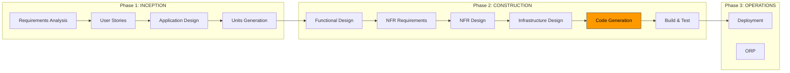
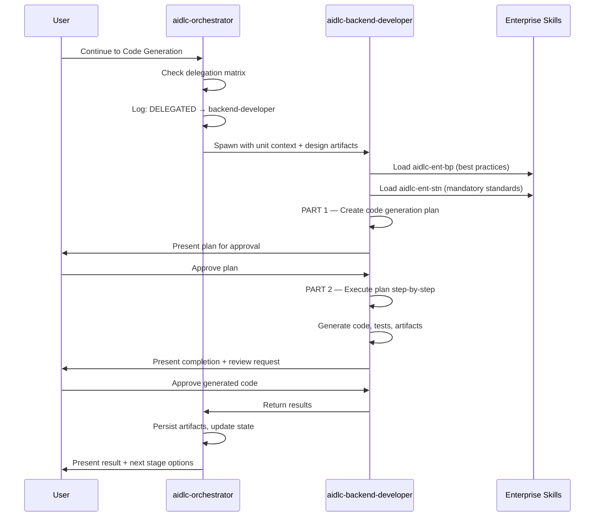
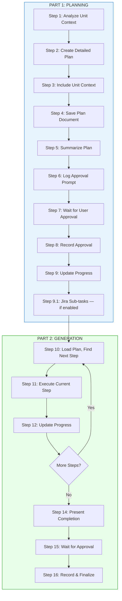
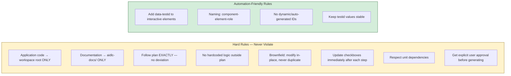
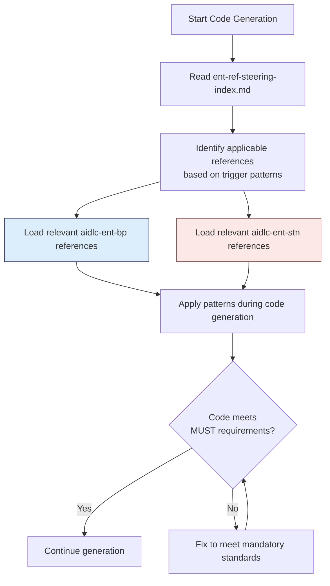
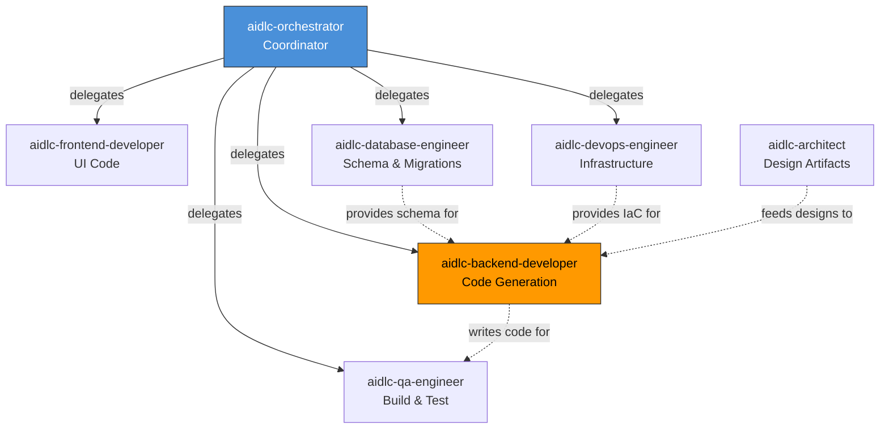

# AIDLC Backend Developer Agent — Complete Reference

> **Agent ID:** `aidlc-backend-developer`  
> **Installed In:** Apex (Kiro IDE Extension)  
> **Version:** Defined in `~/.kiro/agents/aidlc-backend-developer.json`  
> **Author:** architecture-team / aidlc-framework

---

## 1. Overview

The **aidlc-backend-developer** is a specialist sub-agent within the AI-Driven Development Lifecycle (AI-DLC) framework. It is responsible for generating server-side code — APIs, business logic, data models, service layers, and repository patterns — during the **Construction Phase → Code Generation** stage.

It is **never invoked directly by the user**. The **aidlc-orchestrator** agent delegates work to it when the workflow reaches the Code Generation stage and the unit of work is backend-scoped.

---

## 2. Agent Configuration

```json
{
  "name": "aidlc-backend-developer",
  "description": "AI-DLC backend developer for APIs, business logic, and server-side code.",
  "prompt": "file://./aidlc-backend-developer.md",
  "tools": ["read", "write", "shell"],
  "allowedTools": ["read"],
  "resources": [
    "file://.kiro/steering/**/*.md",
    "skill://.kiro/skills/**/SKILL.md",
    "file://~/.kiro/steering/**/*.md",
    "skill://~/.kiro/skills/**/SKILL.md"
  ]
}
```

| Property | Value | Purpose |
|----------|-------|---------|
| `tools` | `read`, `write`, `shell` | Can read files, write code, run shell commands |
| `allowedTools` | `read` | Auto-approved without user confirmation |
| `resources` | Workspace + user steering & skills | Access to all enterprise rules and project context |

---

## 3. Role & Responsibilities

```
┌─────────────────────────────────────────────────┐
│          AIDLC Backend Developer                │
├─────────────────────────────────────────────────┤
│ • Generate server-side code from design docs    │
│ • Implement REST/GraphQL APIs                   │
│ • Build business logic & service layers         │
│ • Create repository patterns & data access      │
│ • Apply clean architecture & SOLID principles   │
│ • Generate unit tests alongside implementation  │
│ • Apply enterprise standards (MUST) & best      │
│   practices (SHOULD)                            │
│ • Follow approved code generation plan exactly  │
└─────────────────────────────────────────────────┘
```

---

## 4. Position in the AI-DLC Lifecycle



> The **Backend Developer** agent is activated at the **Code Generation** stage (highlighted above). It executes only after Functional Design, NFR Design, and Infrastructure Design are complete for the unit.

---

## 5. Invocation & Delegation Flow



---

## 6. Two-Part Execution Workflow



---

## 7. Skills & Steering Files Used

### 7.1 Skills Loaded at Runtime

```mermaid
graph TD
    BD[aidlc-backend-developer] --> ENT_BP[aidlc-ent-bp
Enterprise Best Practices]
    BD --> ENT_STN[aidlc-ent-stn
Enterprise Standards]
    BD --> RULES[aidlc-rules
Stage Rules]

    ENT_BP --> BP1[api-design.md]
    ENT_BP --> BP2[backup.md]
    ENT_BP --> BP3[containers.md]
    ENT_BP --> BP4[dynamodb.md]
    ENT_BP --> BP5[ephemeral-environments.md]
    ENT_BP --> BP6[healthchecks.md]
    ENT_BP --> BP7[integration-testing.md]
    ENT_BP --> BP8[observability.md]
    ENT_BP --> BP9[resiliency.md]
    ENT_BP --> BP10[terraform.md]

    ENT_STN --> STN1[ent-stn-iam.md]
    ENT_STN --> STN2[ent-stn-secrets.md]
    ENT_STN --> STN3[ent-stn-encryption.md]
    ENT_STN --> STN4[ent-stn-logging.md]
    ENT_STN --> STN5[ent-stn-environments.md]
    ENT_STN --> STN6[ent-stn-devops.md]
    ENT_STN --> STN7[arch-stn-822-iam.md]
    ENT_STN --> STN8[arch-stn-828-data.md]
    ENT_STN --> STN9[arch-stn-cloud-aws.md]
    ENT_STN --> STN10[arch-stn-aws-services.md]

    RULES --> CG[construction/code-generation.md]

    style BD fill:#ff9900,stroke:#333,color:#000
    style ENT_BP fill:#dceefb,stroke:#336
    style ENT_STN fill:#fde8e8,stroke:#633
    style RULES fill:#e8f5e9,stroke:#363
```



### 7.2 Skill Details

| Skill | Type | Purpose | References Count |
|-------|------|---------|-----------------|
| `aidlc-ent-bp` | Best Practices (SHOULD) | Recommended patterns for API design, containers, DynamoDB, observability, resiliency, Terraform, testing | 10 reference files |
| `aidlc-ent-stn` | Standards (MUST) | Mandatory requirements for IAM/Okta, secrets, encryption, logging, environments, CI/CD, AWS architecture | 9 reference files |
| `aidlc-rules` | Stage Rules | Code generation workflow steps, checkboxes, approval gates | 1 primary reference |

### 7.3 Steering Files Accessible

The agent has access to all steering files at both levels:

| Scope | Path Pattern | Content |
|-------|-------------|---------|
| Workspace | `.kiro/steering/**/*.md` | Project-specific context (tech stack, structure, product domain) |
| User/Global | `~/.kiro/steering/**/*.md` | Cross-project enterprise rules |

---

## 8. Code Generation Plan Structure

When the backend developer creates a plan, it produces a document at:
```
aidlc-docs/construction/plans/{unit-name}-code-generation-plan.md
```

The plan contains these sequential steps (each with `[ ]` checkboxes):

| Step | Activity | Output |
|------|----------|--------|
| 1 | Project Structure Setup (greenfield only) | Directory skeleton |
| 2 | Business Logic Generation | Service classes, domain logic |
| 3 | Business Logic Unit Testing | Test files for business logic |
| 4 | Business Logic Summary | Documentation |
| 5 | API Layer Generation | Controllers, routes, middleware |
| 6 | API Layer Unit Testing | API test files |
| 7 | API Layer Summary | Documentation |
| 8 | Repository Layer Generation | Data access, queries |
| 9 | Repository Layer Unit Testing | Repository test files |
| 10 | Repository Layer Summary | Documentation |
| 11 | Frontend Components (if applicable) | UI components |
| 12 | Database Migration Scripts | Schema changes |
| 13 | Documentation Generation | API docs, README |
| 14 | Deployment Artifacts | Dockerfiles, IaC, CI/CD |

---

## 9. Critical Rules & Constraints



### Code Location Rules by Project Type

| Project Type | Code Location | Tests Location |
|--------------|--------------|----------------|
| Brownfield | Existing structure (`src/main/java/`, `lib/`, etc.) | Existing test dirs |
| Greenfield Single Unit | `src/`, `tests/`, `config/` at workspace root | `tests/` |
| Greenfield Multi-Unit (Microservices) | `{unit-name}/src/` | `{unit-name}/tests/` |
| Greenfield Multi-Unit (Monolith) | `src/{unit-name}/` | `tests/{unit-name}/` |

---

## 10. Enterprise Compliance Check Flow



### Enterprise Best Practices (SHOULD — Recommended)

| Reference | Covers |
|-----------|--------|
| `api-design.md` | REST conventions, error format, rate limiting, health checks |
| `backup.md` | Backup strategy, RPO/RTO by criticality, DynamoDB layers |
| `containers.md` | Dockerfile security, image scanning, ECS/K8s runtime |
| `dynamodb.md` | Single-table design, 10 principles, key hierarchy, GSI patterns |
| `ephemeral-environments.md` | Terraform preview environments, lifecycle, TTL |
| `healthchecks.md` | Shallow/deep health checks, canary self-test, token management |
| `integration-testing.md` | SVT testing, 10 mandatory categories per endpoint |
| `observability.md` | OpenTelemetry instrumentation, three pillars, structured logging |
| `resiliency.md` | Cache-first, backoff, circuit breaker, graceful degradation |
| `terraform.md` | File structure, state management, modules, naming |

### Enterprise Standards (MUST — Mandatory)

| Reference | Covers |
|-----------|--------|
| `ent-stn-iam.md` | Identity & access management (Okta, OIDC, RBAC, access lifecycle) |
| `ent-stn-secrets.md` | Secrets & credentials (approved stores, rotation, pipeline handling) |
| `ent-stn-encryption.md` | Encryption (TLS config, AES-256, key management, CSPRNG) |
| `ent-stn-logging.md` | Logging & monitoring (what to log, format, retention, Cribl pipeline) |
| `ent-stn-environments.md` | Environment separation (prod/non-prod isolation, data handling) |
| `ent-stn-devops.md` | CI/CD (source control, quality gates, scanning, release governance) |
| `arch-stn-822-iam.md` | STN-822 Okta specifics (grant types, scope naming, approved libraries) |
| `arch-stn-828-data.md` | STN-828 Data architecture (store selection, config management, retention) |
| `arch-stn-cloud-aws.md` | AWS standards (regions, accounts, IAM, encryption, tagging, networking) |
| `arch-stn-aws-services.md` | AWS IaC standards (security groups, service configs) |

---

## 11. Interaction with Other Agents



| Upstream Agent | What It Provides to Backend Developer |
|----------------|--------------------------------------|
| `aidlc-architect` | Application design, ADRs, component diagrams, unit definitions |
| `aidlc-database-engineer` | Data models, schema designs, entity relationships |
| `aidlc-devops-engineer` | Infrastructure design, deployment targets |

| Downstream Agent | What Backend Developer Provides |
|-----------------|-------------------------------|
| `aidlc-qa-engineer` | Generated code + tests for build verification |
| `aidlc-frontend-developer` | API contracts, service interfaces |

---

## 12. Completion Criteria

The backend developer agent marks its work as **complete** when ALL of these are true:

- [x] Complete code generation plan created and approved by user
- [x] All steps in the plan marked `[x]` (no remaining `[ ]`)
- [x] All unit stories implemented according to plan
- [x] All code and unit tests generated (execution happens in Build & Test)
- [x] Deployment artifacts generated
- [x] Complete unit ready for build and verification
- [x] `aidlc-state.md` updated with completion status
- [x] `journal.md` logged with approval timestamp

---

## 13. Summary

The `aidlc-backend-developer` is a disciplined, plan-driven code generation agent that:

1. **Never freelances** — it follows an approved plan exactly, step by step
2. **Never produces without approval** — both the plan and the output require explicit user sign-off
3. **Applies enterprise governance** — mandatory standards (MUST) and recommended patterns (SHOULD) are loaded before any code is written
4. **Generates complete units** — business logic + API layer + repository layer + tests + documentation + deployment artifacts
5. **Supports brownfield and greenfield** — modifies existing files in-place or creates new project structures
6. **Maintains traceability** — every generated file maps back to a user story and a plan step

---

*Generated: June 4, 2026 | Source: `~/.kiro/agents/aidlc-backend-developer.json` + `aidlc-backend-developer.md`* 