# AIDLC Database Engineer Agent — High-Fidelity Reference


> **Generated:** June 9, 2026  

> **Source:** AI-DLC skills, workflow guides, and enterprise standards


---


## Table of Contents


1. [Agent Overview](#1-agent-overview)

2. [Role in the AI-DLC Lifecycle](#2-role-in-the-ai-dlc-lifecycle)

3. [Activation & Trigger Points](#3-activation--trigger-points)

4. [Internal Workflow](#4-internal-workflow)

5. [Skills & Knowledge Sources](#5-skills--knowledge-sources)

6. [Enterprise Standards Applied](#6-enterprise-standards-applied)

7. [Relationships with Other Agents](#7-relationships-with-other-agents)

8. [Inputs & Outputs](#8-inputs--outputs)

9. [Decision Logic](#9-decision-logic)

10. [End-to-End Sequence Diagram](#10-end-to-end-sequence-diagram)

11. [Key Constraints & Guardrails](#11-key-constraints--guardrails)


---


## 1. Agent Overview


The **`database-engineer`** is a specialist sub-agent in the AI-DLC (AI-assisted Development Lifecycle) framework. It is responsible for the **data layer** of any software system being built — covering schema design, data modelling, migrations, query optimisation, and database technology selection.


| Property | Value |

|---|---|

| **Agent Name** | `database-engineer` |

| **Phase** | AI-DLC Construction |

| **Stage** | Code Generation (data layer) |

| **Primary Language** | Context-dependent (SQL, HCL, VBScript stubs, etc.) |

| **Invoked By** | `aidlc-orchestrator` or directly by user |

| **Returns To** | Orchestrator / calling context |


### Core Capabilities


- **Schema Design** — tables, indexes, constraints, relationships

- **Data Modelling** — entity-relationship modelling, normalisation, DDD aggregate mapping

- **Migrations** — forwards and backwards migration scripts

- **Query Optimisation** — explain plans, indexing strategies, N+1 detection

- **Database Selection** — recommends the right store (RDBMS, NoSQL, DynamoDB, etc.) per use case

- **Enterprise Compliance** — enforces TP ICAP STN-828 data architecture and backup standards


---


## 2. Role in the AI-DLC Lifecycle


The AI-DLC has three top-level phases. The `database-engineer` operates exclusively in **Construction**, specifically during **Code Generation**.


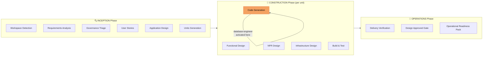


Within **Code Generation**, the orchestrator decomposes work by concern and routes the data-layer work to `database-engineer` while simultaneously routing frontend, backend, and infrastructure work to their respective agents.


---


## 3. Activation & Trigger Points


The agent is invoked when any of the following conditions are true during Construction:


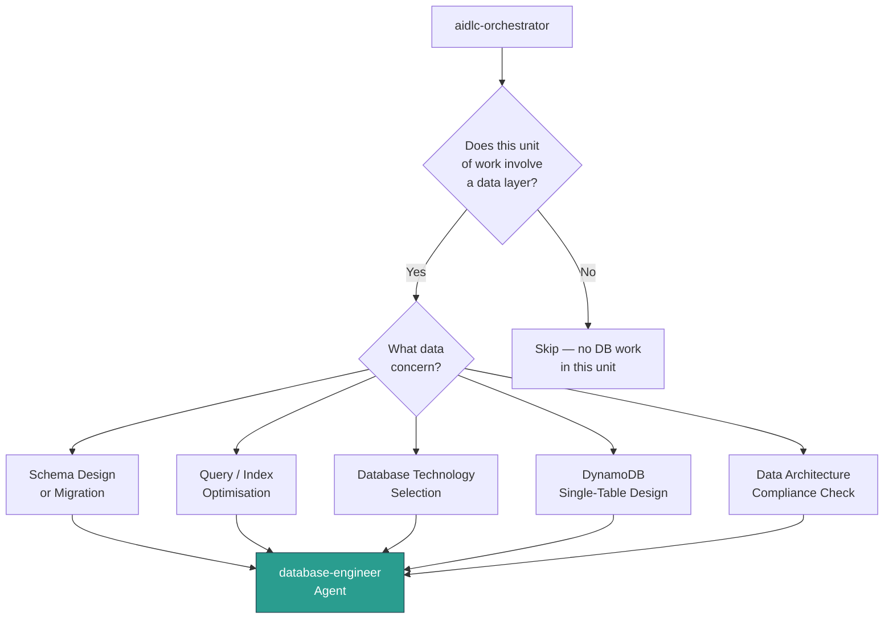


### Direct User Invocation


The user can also invoke the agent directly from Kiro chat by asking:


- *"Design the database schema for…"*

- *"Optimise this query…"*

- *"Which database should I use for…"*

- *"Help me write a migration for…"*


---


## 4. Internal Workflow


Once invoked, the agent follows a structured internal process:


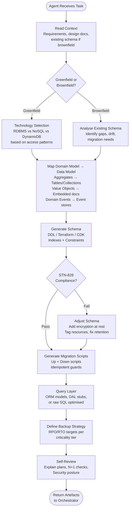


### Step-by-Step Breakdown


| Step | What Happens |

|---|---|

| **1. Read Context** | Agent consumes requirements, application design, DDD model, NFR targets, and any existing schema |

| **2. Greenfield / Brownfield Split** | For new systems: tech selection + full schema. For existing: gap analysis + targeted migrations |

| **3. Technology Selection** | Evaluates RDBMS (PostgreSQL, Aurora), NoSQL (MongoDB, DocumentDB), and DynamoDB against access patterns, scale, and enterprise standards |

| **4. DDD → Data Model Mapping** | Aggregates become consistency boundaries (tables or DynamoDB top-level items). Value Objects become embedded columns/attributes. Domain Events become event-store entries |

| **5. Schema Generation** | Produces DDL, Terraform HCL, or AWS CDK depending on target. Includes indexes, constraints, encryption config |

| **6. STN-828 Compliance Check** | Verifies store selection aligns with data architecture standard, encryption at rest is on, retention is defined, tagging is present |

| **7. Migration Scripts** | Forwards + backwards, idempotent, safe for zero-downtime deploys |

| **8. Query Layer** | ORM model stubs, DAL interfaces, or raw SQL as appropriate |

| **9. Backup Strategy** | RPO/RTO defined, three-layer DynamoDB backup or equivalent RDBMS strategy per criticality |

| **10. Self-Review** | Checks explain plans, spots N+1 risks, verifies security posture before handing off |


---


## 5. Skills & Knowledge Sources


The agent draws on several AI-DLC skills and reference documents:


```mermaid

mindmap

  root((database-engineer))

    aidlc-ddd-modeling

      Aggregate design

      Entity vs Value Object

      Domain Events

      Repository pattern

      Bounded contexts

    aidlc-ent-bp

      dynamodb.md

        Single-table design

        10 DynamoDB principles

        Key hierarchy

        GSI patterns

      backup.md

        3-layer backup

        RPO/RTO tiers

      observability.md

        Query metrics

        Slow query logging

    aidlc-ent-stn

      arch-stn-828-data.md

        Store selection rules

        Config management

        Data retention

      ent-stn-encryption.md

        AES-256 at rest

        Key management

      ent-stn-logging.md

        Audit trail requirements

    aidlc-rules

      construction/functional-design.md

      construction/nfr-requirements.md

      construction/code-generation.md

```


### Key Reference Documents


| Reference | What It Provides | Type |

|---|---|---|

| `arch-stn-828-data.md` | Mandatory store selection criteria, config management, retention policy | **Standard (MUST)** |

| `ent-stn-encryption.md` | AES-256 at rest, key management, CSPRNG | **Standard (MUST)** |

| `dynamodb.md` | Single-table design, 10 principles, GSI patterns | **Best Practice (SHOULD)** |

| `backup.md` | RPO/RTO tiers, three-layer DynamoDB backup | **Best Practice (SHOULD)** |

| `observability.md` | Query metrics, structured logging | **Best Practice (SHOULD)** |

| `aidlc-ddd-modeling` skill | Aggregate → table mapping, bounded context data isolation | **Design Pattern** |


---


## 6. Enterprise Standards Applied


The agent is a key enforcer of TP ICAP's data-layer governance:


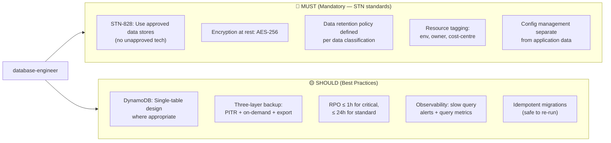


### Compliance Failure Handling


If the agent detects a violation of a `MUST` standard:


1. It **does not proceed** with schema generation

2. It **flags the violation** with the relevant STN reference

3. It **proposes a compliant alternative**

4. It **logs to** `governance-shadow-log.md` (or presents in active mode)


---


## 7. Relationships with Other Agents


The `database-engineer` does not work in isolation. It has defined interfaces with six other agents:


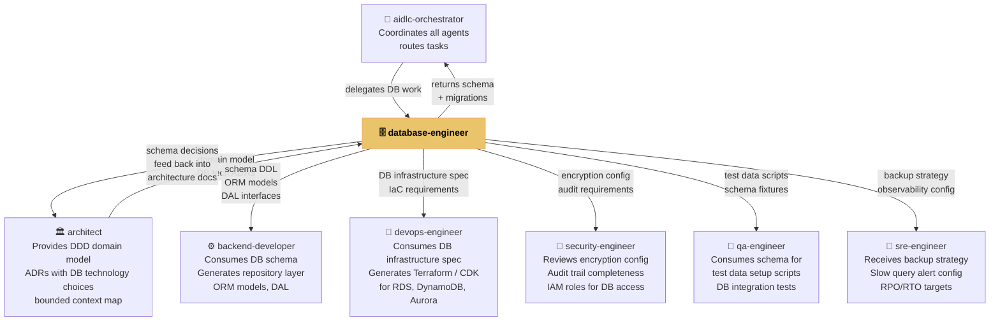


### Interaction Detail


| Agent | What DB Engineer Receives | What DB Engineer Provides |

|---|---|---|

| **aidlc-orchestrator** | Task assignment, unit of work definition | Completed schema, migrations, compliance sign-off |

| **architect** | DDD domain model, bounded contexts, DB technology ADRs | Schema decisions, trade-offs, any ADR amendments |

| **backend-developer** | Consumes the schema | DDL, ORM model stubs, repository interface definitions |

| **devops-engineer** | Consumes infrastructure spec | Terraform/CDK resources (RDS, DynamoDB, Aurora clusters) |

| **security-engineer** | Reviews the agent's output | Encryption configuration, IAM role requirements for DB |

| **qa-engineer** | Uses schema for test setup | Test data seed scripts, schema fixtures |

| **sre-engineer** | Operationalises the backup plan | Backup strategy document, slow query alert thresholds |


---


## 8. Inputs & Outputs


### Inputs


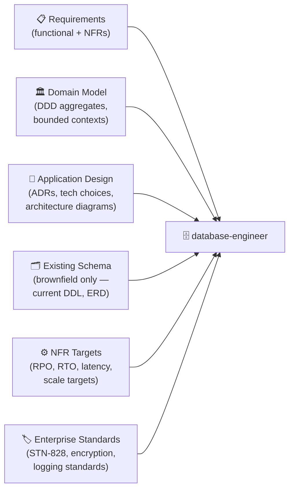


### Outputs


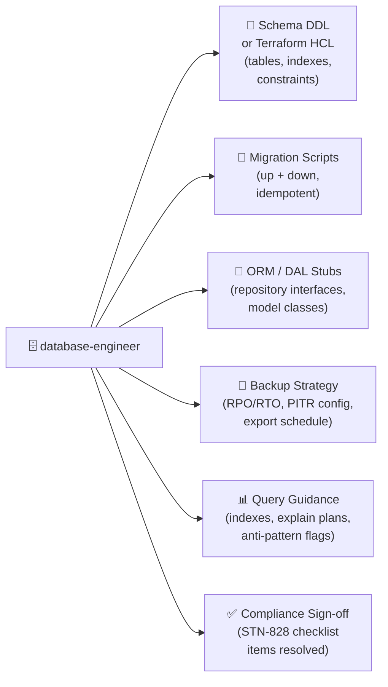


---


## 9. Decision Logic


### Technology Selection Decision Tree


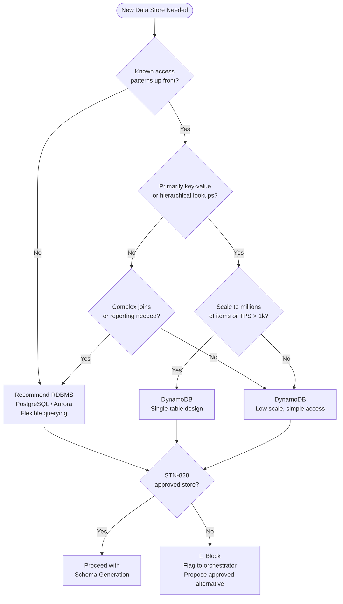


### Migration Strategy Decision Tree


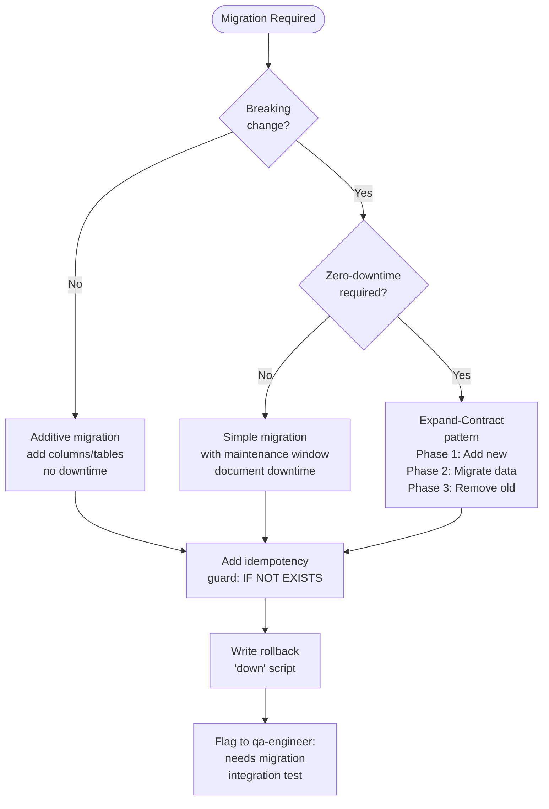


---


## 10. End-to-End Sequence Diagram


This shows the full journey of a typical database engineering task within a Construction cycle:


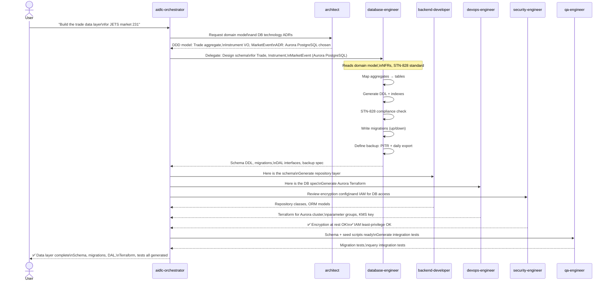


---


## 11. Key Constraints & Guardrails


### Hard Rules (Agent Will Not Violate)


| Constraint | Reason |

|---|---|

| Will not generate schema for unapproved data stores | STN-828 mandatory requirement |

| Will not omit encryption at rest | Enterprise encryption standard |

| Will not skip backup strategy definition | Enterprise backup standard |

| Will not generate migrations without rollback scripts | Data safety |

| Will not produce schema without resource tagging | AWS standards, cost governance |


### Soft Rules (Flagged, Not Blocked)


| Guideline | What Happens if Skipped |

|---|---|

| Single-table DynamoDB design | Agent flags and explains trade-offs, documents in ADR |

| Idempotent migration guards | Agent flags the risk, asks for explicit acknowledgement |

| Slow query observability hooks | Flagged to SRE agent for implementation |

| Test data seed scripts | Flagged to QA agent |


### Governance Integration


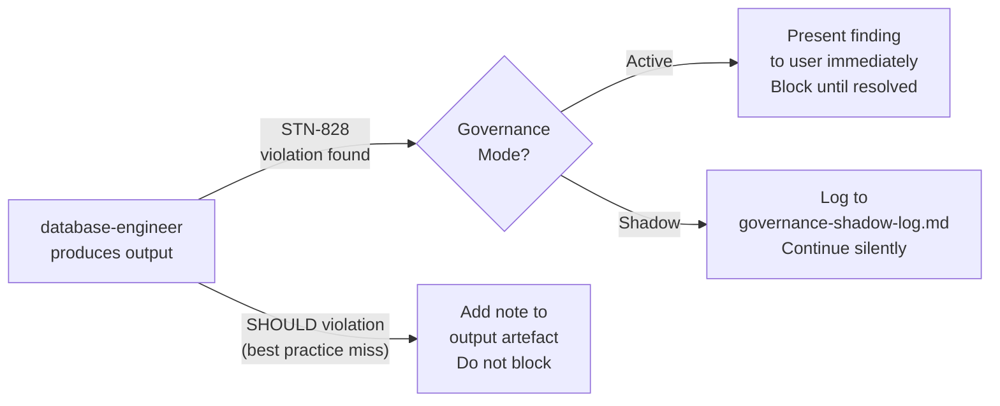


### Interaction with Opt-In Rules


The following AI-DLC opt-in governance flows can affect the database-engineer's output:


| Opt-In Rule | How It Affects DB Engineer |

|---|---|

| **standards-check** (always-on) | Every DB technology ADR written is checked against STN-828 and approved store list |

| **security-review** | Triggers `security-engineer` to audit DB encryption, IAM, and audit logging after schema is complete |

| **test-evidence** | `qa-engineer` must produce and pass migration integration tests before the unit is marked done |

| **delivery-verification** | In Operations phase, the generated schema is compared against application design — drift is flagged |


---


## Summary


The `database-engineer` agent is the **data layer specialist** in the AI-DLC Construction phase. It translates domain models from the architect into compliant, production-ready schemas, migrations, and backup strategies. It is invoked by the orchestrator, receives design context from the architect, and feeds its outputs to the backend developer, DevOps engineer, security engineer, QA engineer, and SRE.


Its outputs are governed by two mandatory TP ICAP standards (STN-828 data architecture and enterprise encryption) and several best-practice references (DynamoDB single-table design, backup tiers, observability patterns). It will not produce schema that violates mandatory standards and integrates with the governance pipeline for both active and shadow modes.


---


*Document generated by Kiro from AI-DLC skill disclosures and workflow analysis.*

 