# AIDLC DevOps Engineer Agent — Complete Reference


> **Agent ID:** `aidlc-devops-engineer`  

> **Installed In:** Apex (Kiro IDE Extension)  

> **Version:** Defined in `~/.kiro/agents/aidlc-devops-engineer.json`  

> **Author:** architecture-team / aidlc-framework


---


## 1. Overview


The **aidlc-devops-engineer** is a specialist sub-agent within the AI-Driven Development Lifecycle (AI-DLC) framework. It is responsible for generating Infrastructure as Code (IaC), designing CI/CD pipelines, configuring containerization, automating deployment strategies, and producing operational runbooks — during the **Construction Phase → Infrastructure Design** stage and the **Operations Phase**.


It is **never invoked directly by the user**. The **aidlc-orchestrator** agent delegates work to it when the workflow reaches the Infrastructure Design stage or when operational infrastructure concerns need addressing.


---


## 2. Agent Configuration


```json

{

  "name": "aidlc-devops-engineer",

  "description": "AI-DLC DevOps engineer for IaC, CI/CD, and deployment automation.",

  "prompt": "file://./aidlc-devops-engineer.md",

  "tools": ["read", "write", "shell"],

  "allowedTools": ["read"],

  "resources": [

    "file://.kiro/steering/**/*.md",

    "skill://.kiro/skills/**/SKILL.md",

    "file://~/.kiro/steering/**/*.md",

    "skill://~/.kiro/skills/**/SKILL.md"

  ]

}

```


| Property | Value | Purpose |

|----------|-------|---------|

| `tools` | `read`, `write`, `shell` | Can read files, write IaC/pipeline code, run shell commands |

| `allowedTools` | `read` | Auto-approved without user confirmation |

| `resources` | Workspace + user steering & skills | Access to all enterprise rules and project context |


---


## 3. Role & Responsibilities


```

┌─────────────────────────────────────────────────┐

│          AIDLC DevOps Engineer                  │

├─────────────────────────────────────────────────┤

│ • Generate Infrastructure as Code              │

│   (CDK, CloudFormation, Terraform)             │

│ • Design and implement CI/CD pipelines         │

│ • Configure containerization                   │

│   (Docker, ECS, EKS)                           │

│ • Automate deployment strategies               │

│   (blue/green, canary, rolling)                │

│ • Generate deployment documentation &          │

│   operational runbooks                         │

│ • Map logical components to cloud services     │

│ • Apply enterprise standards (MUST) & best     │

│   practices (SHOULD) to infrastructure         │

│ • Follow approved infrastructure design plan   │

│   exactly                                      │

│ • Produce Operational Readiness Packs (ORP)    │

│   when opt-in is enabled                       │

└─────────────────────────────────────────────────┘

```


---


## 4. Position in the AI-DLC Lifecycle


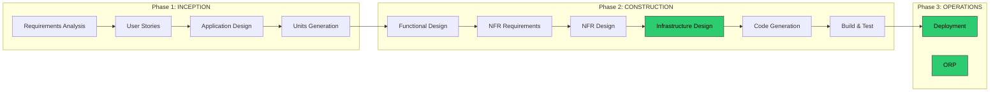


> The **DevOps Engineer** agent is activated at **two points** (highlighted above):

> 1. **Infrastructure Design** — during Construction, after NFR Design is complete

> 2. **Operations** — deployment, ORP generation, and production readiness


---


## 5. Invocation & Delegation Flow


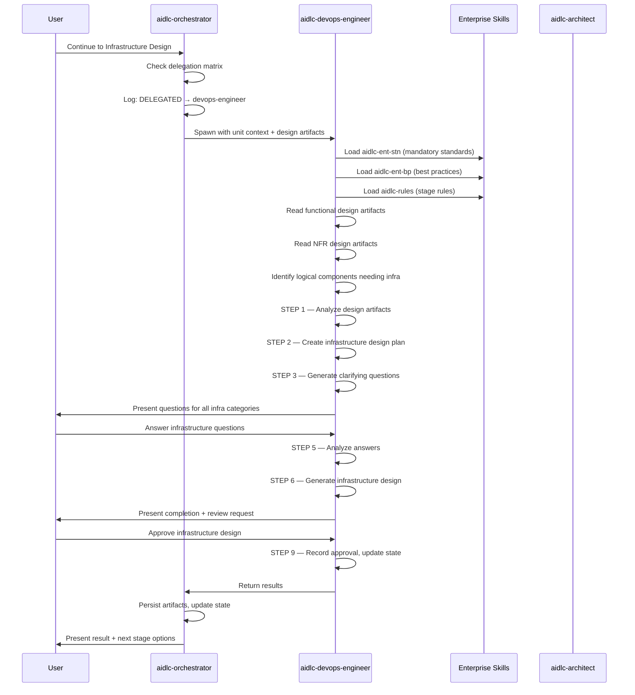


---


## 6. Multi-Step Execution Workflow


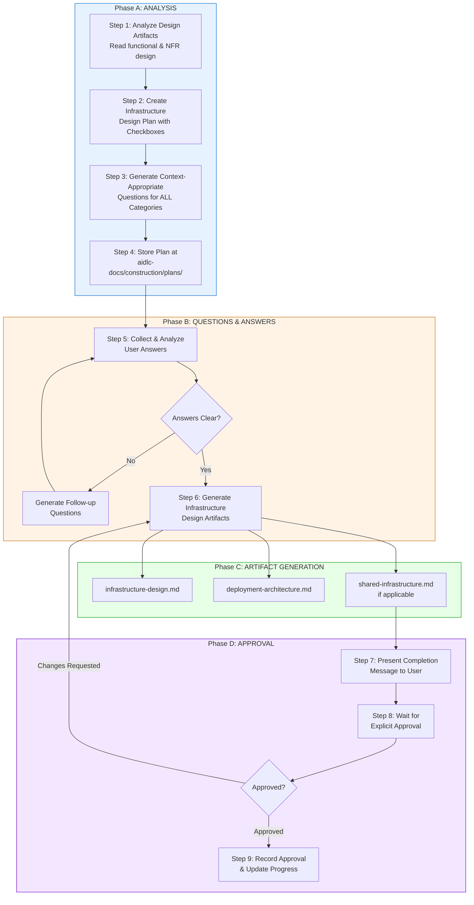


---


## 7. Infrastructure Question Categories


The DevOps Engineer is **mandated** to evaluate ALL of the following categories when generating clarifying questions. Each category is assessed based on evidence from functional and NFR design artifacts:


```mermaid

mindmap

    root((Infrastructure<br/>Questions))

        Deployment Environment

            Cloud provider preferences

            Environment setup

            Deployment targets

            Region strategy

        Compute Infrastructure

            Compute service choices

            Sizing requirements

            Scaling strategy

            Serverless vs containers

        Storage Infrastructure

            Database selection

            Storage patterns

            Data lifecycle needs

            Backup requirements

        Messaging Infrastructure

            Messaging/queuing services

            Event-driven patterns

            Async processing

            Message bus selection

        Networking Infrastructure

            Load balancing

            API gateway approach

            Network topology

            VPC design

        Monitoring Infrastructure

            Observability tooling

            Alerting strategy

            Logging requirements

            Dashboard design

        Shared Infrastructure

            Infrastructure sharing

            Multi-tenancy

            Resource isolation

            Cost allocation

```


> **CRITICAL RULE**: Default to asking questions when there is ANY ambiguity. Overconfidence leads to poor infrastructure choices.


---


## 8. Skills & Steering Files Used


### 8.1 Skills Loaded at Runtime


```mermaid

graph TD

    DO[aidlc-devops-engineer] --> ENT_STN[aidlc-ent-stn<br/>Enterprise Standards]

    DO --> ENT_BP[aidlc-ent-bp<br/>Enterprise Best Practices]

    DO --> RULES[aidlc-rules<br/>Stage Rules]



    ENT_STN --> STN1[ent-stn-devops.md<br/>CI/CD Standards]

    ENT_STN --> STN2[ent-stn-environments.md<br/>Environment Separation]

    ENT_STN --> STN3[ent-stn-encryption.md<br/>Encryption Standards]

    ENT_STN --> STN4[ent-stn-iam.md<br/>Identity & Access Mgmt]

    ENT_STN --> STN5[ent-stn-logging.md<br/>Logging & Monitoring]

    ENT_STN --> STN6[ent-stn-secrets.md<br/>Secrets Management]

    ENT_STN --> STN7[arch-stn-cloud-aws.md<br/>AWS Cloud Standards]

    ENT_STN --> STN8[arch-stn-aws-services.md<br/>AWS IaC Standards]

    ENT_STN --> STN9[arch-stn-822-iam.md<br/>STN-822 Okta/OIDC]

    ENT_STN --> STN10[arch-stn-828-data.md<br/>STN-828 Data Architecture]



    ENT_BP --> BP1[terraform.md<br/>Terraform Patterns]

    ENT_BP --> BP2[containers.md<br/>Container Security]

    ENT_BP --> BP3[ephemeral-environments.md<br/>Preview Environments]

    ENT_BP --> BP4[backup.md<br/>Backup Strategy]

    ENT_BP --> BP5[observability.md<br/>OpenTelemetry]

    ENT_BP --> BP6[resiliency.md<br/>Resilience Patterns]

    ENT_BP --> BP7[healthchecks.md<br/>Health Checks]

    ENT_BP --> BP8[dynamodb.md<br/>DynamoDB Patterns]

    ENT_BP --> BP9[integration-testing.md<br/>SVT Testing]

    ENT_BP --> BP10[api-design.md<br/>API Conventions]



    RULES --> ID[construction/infrastructure-design.md]

    RULES --> OPS[operations/operations.md]



    style DO fill:#2ecc71,stroke:#333,color:#000

    style ENT_STN fill:#fde8e8,stroke:#633

    style ENT_BP fill:#dceefb,stroke:#336

    style RULES fill:#e8f5e9,stroke:#363

```


### 8.2 Skill Details


| Skill | Type | Purpose | Primary References for DevOps |

|-------|------|---------|-------------------------------|

| `aidlc-ent-stn` | Standards (MUST) | Mandatory enterprise requirements | `ent-stn-devops.md`, `ent-stn-environments.md`, `arch-stn-cloud-aws.md`, `arch-stn-aws-services.md` |

| `aidlc-ent-bp` | Best Practices (SHOULD) | Recommended patterns | `terraform.md`, `containers.md`, `ephemeral-environments.md`, `backup.md`, `observability.md` |

| `aidlc-rules` | Stage Rules | Infrastructure design workflow, checkboxes, approval gates | `construction/infrastructure-design.md`, `operations/operations.md` |


### 8.3 DevOps-Specific Enterprise Standards (MUST — Mandatory)


| Standard Reference | Covers | DevOps Application |

|-------------------|--------|-------------------|

| `ent-stn-devops.md` | Source control, quality gates, scanning, release governance | Pipeline design, gate enforcement, release automation |

| `ent-stn-environments.md` | Prod/non-prod isolation, data handling | Environment separation, infrastructure isolation |

| `ent-stn-encryption.md` | TLS config, AES-256, key management | Secrets in transit, certificate management, KMS |

| `ent-stn-iam.md` | Okta, OIDC, RBAC, access lifecycle | Service accounts, IAM roles, pipeline credentials |

| `ent-stn-secrets.md` | Approved stores, rotation, pipeline handling | Secrets Manager/Parameter Store, rotation automation |

| `ent-stn-logging.md` | What to log, format, retention, Cribl | Log aggregation, monitoring infrastructure, retention |

| `arch-stn-cloud-aws.md` | Regions, accounts, IAM, encryption, tagging, networking | AWS architecture decisions, tagging standards, VPC design |

| `arch-stn-aws-services.md` | Security groups, service configurations | IaC patterns, service-specific configuration |

| `arch-stn-822-iam.md` | STN-822 Okta specifics (grant types, scopes) | Service-to-service auth, pipeline OAuth |

| `arch-stn-828-data.md` | Store selection, config management, retention | Database infrastructure, data lifecycle automation |


### 8.4 DevOps-Specific Best Practices (SHOULD — Recommended)


| Practice Reference | Covers | DevOps Application |

|-------------------|--------|-------------------|

| `terraform.md` | File structure, state management, modules, naming | IaC generation, module design, backend config |

| `containers.md` | Dockerfile security, image scanning, ECS/K8s runtime | Container builds, registry security, orchestration |

| `ephemeral-environments.md` | Terraform preview environments, lifecycle, TTL | PR-based preview environments, auto-teardown |

| `backup.md` | Backup strategy, RPO/RTO by criticality, DynamoDB layers | Backup automation, DR infrastructure, retention |

| `observability.md` | OpenTelemetry instrumentation, three pillars, structured logging | Monitoring stack, dashboards, alerting rules |

| `resiliency.md` | Cache-first, backoff, circuit breaker, graceful degradation | Infrastructure resilience, multi-AZ, auto-scaling |

| `healthchecks.md` | Shallow/deep health checks, canary self-test, token management | ALB health checks, liveness/readiness probes |

| `dynamodb.md` | Single-table design, 10 principles, key hierarchy, GSI patterns | DynamoDB provisioning, capacity planning, GSI design |

| `integration-testing.md` | SVT testing, 10 mandatory categories per endpoint | Pipeline test stages, integration test infra |

| `api-design.md` | REST conventions, error format, rate limiting | API Gateway configuration, throttling policies |


### 8.5 Steering Files Accessible


The agent has access to all steering files at both levels:


| Scope | Path Pattern | Content |

|-------|-------------|---------|

| Workspace | `.kiro/steering/**/*.md` | Project-specific context (tech stack, structure, product domain) |

| User/Global | `~/.kiro/steering/**/*.md` | Cross-project enterprise rules |


---


## 9. Infrastructure Design Artifacts Generated


The DevOps Engineer produces these artifacts, stored at specific locations:


```mermaid

graph TD

    DO[DevOps Engineer Output] --> PLAN[Infrastructure Design Plan<br/>aidlc-docs/construction/plans/<br/>{unit}-infrastructure-design-plan.md]

    DO --> INFRA[Infrastructure Design<br/>aidlc-docs/construction/{unit}/<br/>infrastructure-design/infrastructure-design.md]

    DO --> DEPLOY[Deployment Architecture<br/>aidlc-docs/construction/{unit}/<br/>infrastructure-design/deployment-architecture.md]

    DO --> SHARED[Shared Infrastructure<br/>aidlc-docs/construction/<br/>shared-infrastructure.md]

    DO --> IAC[IaC Code<br/>workspace root /<br/>Terraform, CDK, or CloudFormation]

    DO --> PIPE[CI/CD Pipeline Code<br/>workspace root /<br/>buildspec, Jenkinsfile, etc.]

    DO --> DOCKER[Container Configs<br/>workspace root /<br/>Dockerfile, docker-compose]

    DO --> ORP_DOC[Operational Readiness Pack<br/>aidlc-docs/{feature}/<br/>operations/operational-readiness-pack.md]


    style PLAN fill:#e6f3ff,stroke:#0066cc

    style INFRA fill:#e6ffe6,stroke:#009900

    style DEPLOY fill:#e6ffe6,stroke:#009900

    style SHARED fill:#fff3e6,stroke:#cc6600

    style IAC fill:#f0f0f0,stroke:#333

    style PIPE fill:#f0f0f0,stroke:#333

    style DOCKER fill:#f0f0f0,stroke:#333

    style ORP_DOC fill:#f3e6ff,stroke:#6600cc

```


| Artifact | Location | When Generated |

|----------|----------|---------------|

| Infrastructure Design Plan | `aidlc-docs/construction/plans/{unit-name}-infrastructure-design-plan.md` | Step 4 — always |

| Infrastructure Design | `aidlc-docs/construction/{unit-name}/infrastructure-design/infrastructure-design.md` | Step 6 — always |

| Deployment Architecture | `aidlc-docs/construction/{unit-name}/infrastructure-design/deployment-architecture.md` | Step 6 — always |

| Shared Infrastructure | `aidlc-docs/construction/shared-infrastructure.md` | Step 6 — if shared infra detected |

| IaC Code (Terraform/CDK/CFN) | Workspace root | Code Generation stage (separate delegation) |

| CI/CD Pipeline Definitions | Workspace root | Code Generation stage |

| Dockerfiles / Compose | Workspace root | Code Generation stage |

| Operational Readiness Pack | `aidlc-docs/{feature}/operations/operational-readiness-pack.md` | Operations phase (ORP opt-in) |


> **CRITICAL RULE**: IaC code is written to workspace root — NEVER to `aidlc-docs/`. Documentation goes to `aidlc-docs/` — NEVER code.


---


## 10. Deployment Strategy Capabilities


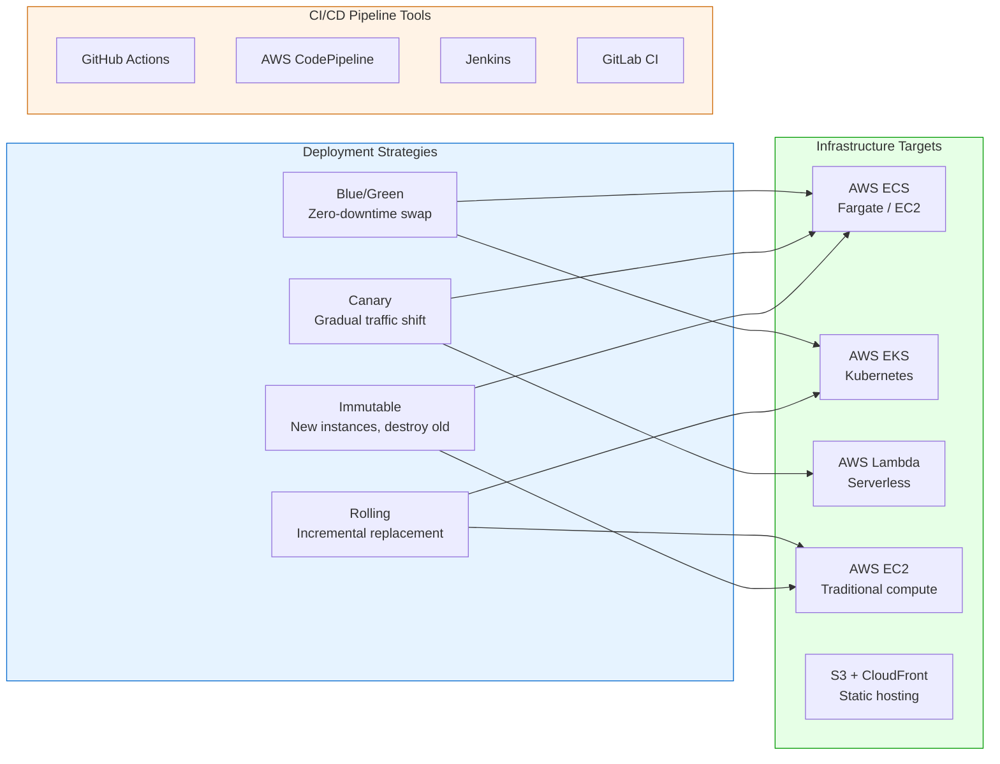


---


## 11. Enterprise Compliance Check Flow (DevOps-Specific)


```mermaid

flowchart TD

    START[Start Infrastructure Design] --> READ_INDEX[Read ent-ref-steering-index.md]

    READ_INDEX --> IDENTIFY[Identify applicable references<br/>via trigger patterns]

    IDENTIFY --> LOAD_STN[Load relevant aidlc-ent-stn references]

    IDENTIFY --> LOAD_BP[Load relevant aidlc-ent-bp references]

    LOAD_STN --> APPLY[Apply patterns during design]

    LOAD_BP --> APPLY



    APPLY --> CHECK_AWS{AWS infrastructure?}

    CHECK_AWS -->|Yes| APPLY_AWS[Apply arch-stn-cloud-aws<br/>Regions, accounts, tagging, VPC]

    CHECK_AWS -->|No| CHECK_CICD



    APPLY_AWS --> CHECK_IAC{IaC detected?}

    CHECK_IAC -->|Yes| APPLY_IAC[Apply arch-stn-aws-services<br/>Security groups, service config]

    CHECK_IAC -->|No| CHECK_CICD



    APPLY_IAC --> CHECK_CICD{CI/CD pipeline?}

    CHECK_CICD -->|Yes| APPLY_CICD[Apply ent-stn-devops<br/>Quality gates, scanning, release]

    CHECK_CICD -->|No| CHECK_ENV



    APPLY_CICD --> CHECK_ENV{Multi-environment?}

    CHECK_ENV -->|Yes| APPLY_ENV[Apply ent-stn-environments<br/>Prod/non-prod isolation]

    CHECK_ENV -->|No| CHECK_SEC



    APPLY_ENV --> CHECK_SEC{Secrets handling?}

    CHECK_SEC -->|Yes| APPLY_SEC[Apply ent-stn-secrets<br/>Approved stores, rotation]

    CHECK_SEC -->|No| CHECK_TF



    APPLY_SEC --> CHECK_TF{Terraform used?}

    CHECK_TF -->|Yes| APPLY_TF[Apply terraform.md BP<br/>State mgmt, modules, naming]

    CHECK_TF -->|No| CHECK_CONT



    APPLY_TF --> CHECK_CONT{Containers used?}

    CHECK_CONT -->|Yes| APPLY_CONT[Apply containers.md BP<br/>Dockerfile security, scanning]

    CHECK_CONT -->|No| VERIFY



    APPLY_CONT --> VERIFY{All MUST<br/>requirements met?}

    VERIFY -->|Yes| CONTINUE[Continue design/generation]

    VERIFY -->|No| FIX[Fix to meet mandatory standards]

    FIX --> VERIFY



    style LOAD_STN fill:#fde8e8,stroke:#633

    style LOAD_BP fill:#dceefb,stroke:#336

    style APPLY_AWS fill:#fde8e8,stroke:#633

    style APPLY_IAC fill:#fde8e8,stroke:#633

    style APPLY_CICD fill:#fde8e8,stroke:#633

    style APPLY_ENV fill:#fde8e8,stroke:#633

    style APPLY_SEC fill:#fde8e8,stroke:#633

    style APPLY_TF fill:#dceefb,stroke:#336

    style APPLY_CONT fill:#dceefb,stroke:#336

```


---


## 12. Operational Readiness Pack (ORP) — Opt-In Workflow


When the ORP opt-in rule is active, the DevOps Engineer generates the Operational Readiness Pack as a production boundary gate:


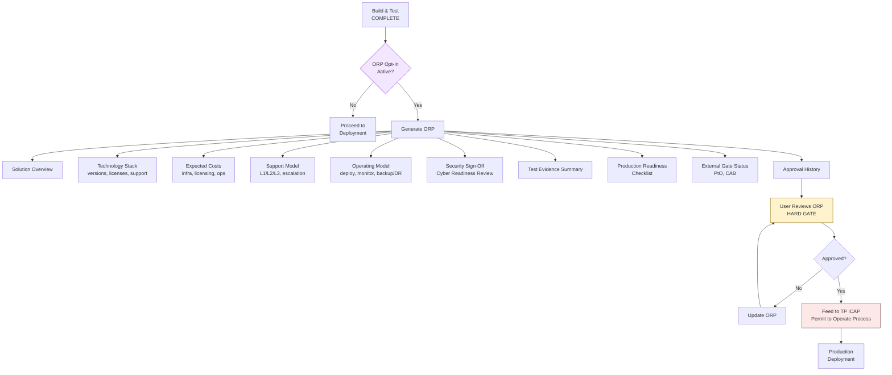


### ORP Mandatory Sections


| # | Section | Content Source |

|---|---------|---------------|

| 1 | Solution Overview | Refined intent from requirements |

| 2 | Technology Stack | NFR Design (versions, licenses, support, SET registry) |

| 3 | Expected Costs | Infrastructure Design or enterprise input |

| 4 | Support Model | L1/L2/L3 tiers, escalation, on-call |

| 5 | Operating Model | Deployment strategy, monitoring, backup/DR, capacity |

| 6 | Security Sign-Off | Cyber Readiness Review outcome |

| 7 | Test Evidence Summary | Build & Test results |

| 8 | Production Readiness Checklist | Cross-lifecycle evidence |

| 9 | External Gate Status | PtO/CAB engagement status |

| 10 | Approval History | Review timestamps |


> **CRITICAL**: The ORP prepares evidence for TP ICAP's real Permit to Operate (PtO) process — it does NOT replace PtO. The PtO Lead decides; the harness prepares.


---


## 13. Critical Rules & Constraints


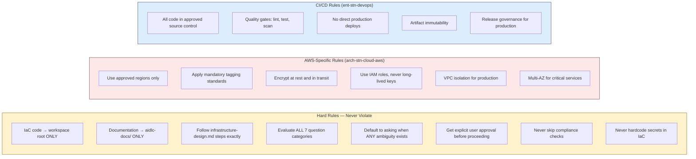


### Code Location Rules


| Artifact Type | Location | Never Write To |

|---------------|----------|----------------|

| Terraform modules | Workspace root (`infra/`, `terraform/`) | `aidlc-docs/` |

| CDK stacks | Workspace root (`cdk/`, `lib/`) | `aidlc-docs/` |

| CloudFormation templates | Workspace root (`cfn/`, `templates/`) | `aidlc-docs/` |

| Dockerfiles | Workspace root (project root or service dir) | `aidlc-docs/` |

| Pipeline definitions | Workspace root (`.github/`, `buildspec/`, etc.) | `aidlc-docs/` |

| Infrastructure design docs | `aidlc-docs/construction/{unit}/infrastructure-design/` | Workspace root |

| ORP documents | `aidlc-docs/{feature}/operations/` | Workspace root |


---


## 14. Interaction with Other Agents


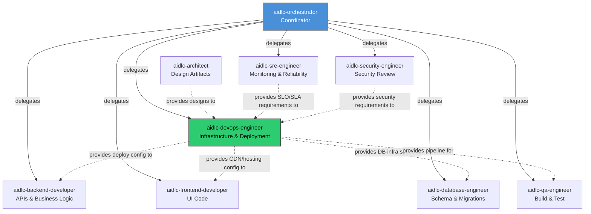


| Upstream Agent | What It Provides to DevOps Engineer |

|----------------|-------------------------------------|

| `aidlc-architect` | Application design, component diagrams, deployment topology |

| `aidlc-security-engineer` | Security requirements, Cyber Readiness Review findings |

| `aidlc-sre-engineer` | SLO/SLA requirements, monitoring requirements, capacity needs |


| Downstream Agent | What DevOps Engineer Provides |

|-----------------|------------------------------|

| `aidlc-backend-developer` | Deployment targets, environment variables, IaC references |

| `aidlc-frontend-developer` | CDN configuration, static hosting setup, environment injection |

| `aidlc-database-engineer` | Database infrastructure specs, provisioned capacity, backup config |

| `aidlc-qa-engineer` | Pipeline stages, test infrastructure, integration test environments |


---


## 15. Technology Stack Coverage


```mermaid

graph TD

    DEVOPS[DevOps Engineer] --> IAC{Infrastructure as Code}

    IAC --> TF[Terraform<br/>HCL modules, state, workspaces]

    IAC --> CDK[AWS CDK<br/>TypeScript/Python stacks]

    IAC --> CFN[CloudFormation<br/>YAML/JSON templates]



    DEVOPS --> CONT{Containerization}

    CONT --> DOCKER[Docker<br/>Multi-stage builds, security]

    CONT --> ECS[AWS ECS<br/>Fargate, task definitions]

    CONT --> EKS[AWS EKS<br/>Kubernetes manifests, Helm]



    DEVOPS --> CICD{CI/CD Pipelines}

    CICD --> GHA[GitHub Actions<br/>Workflows, reusable actions]

    CICD --> CP[AWS CodePipeline<br/>CodeBuild, CodeDeploy]

    CICD --> JNK[Jenkins<br/>Declarative pipelines]

    CICD --> GL[GitLab CI<br/>Stages, jobs, runners]



    DEVOPS --> CLOUD{Cloud Services}

    CLOUD --> COMPUTE[Compute<br/>Lambda, ECS, EC2, EKS]

    CLOUD --> STORAGE[Storage<br/>S3, DynamoDB, RDS, ElastiCache]

    CLOUD --> NETWORK[Networking<br/>VPC, ALB, CloudFront, Route53]

    CLOUD --> SECURITY[Security<br/>IAM, KMS, Secrets Manager, WAF]

    CLOUD --> MONITOR[Monitoring<br/>CloudWatch, X-Ray, SNS]



    style DEVOPS fill:#2ecc71,stroke:#333,color:#000

    style IAC fill:#e6f3ff,stroke:#0066cc

    style CONT fill:#e6ffe6,stroke:#009900

    style CICD fill:#fff3e6,stroke:#cc6600

    style CLOUD fill:#f3e6ff,stroke:#6600cc

```


---


## 16. Pipeline Quality Gate Enforcement


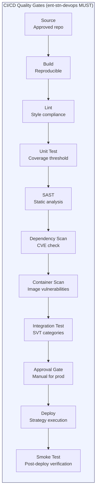


| Gate | Tool/Service | Standard |

|------|-------------|----------|

| Source | Git (approved platforms) | `ent-stn-devops.md` — approved source control only |

| Build | CodeBuild / Docker | Reproducible, deterministic builds |

| Lint | ESLint, flake8, tflint | Zero errors before proceeding |

| Unit Test | Jest, pytest, Go test | Coverage per project target (≥85% recommended) |

| SAST | SonarQube, Snyk Code | Zero critical/high findings |

| Dependency Scan | Snyk, npm audit | No known critical CVEs |

| Container Scan | Trivy, ECR scanning | No critical vulnerabilities in base images |

| Integration Test | Custom SVT framework | 10 mandatory categories per endpoint |

| Approval Gate | Manual / CODEOWNERS | Required for production releases |

| Deploy | CodeDeploy / ArgoCD | Strategy per deployment-architecture.md |

| Smoke Test | Automated health check | All endpoints responding within SLA |


---


## 17. Completion Criteria


The DevOps Engineer agent marks its work as **complete** when ALL of these are true:


**For Infrastructure Design stage:**

- [x] All design artifacts analyzed (functional + NFR)

- [x] All 7 question categories evaluated

- [x] User answered all clarifying questions

- [x] Infrastructure design document generated

- [x] Deployment architecture document generated

- [x] Shared infrastructure documented (if applicable)

- [x] All enterprise MUST standards applied and verified

- [x] User explicitly approved the infrastructure design

- [x] `aidlc-state.md` updated with completion status

- [x] `journal.md` logged with approval timestamp


**For Operations stage (when ORP opt-in active):**

- [x] Build & Test stage confirmed complete

- [x] All 10 ORP mandatory sections produced

- [x] Evidence consolidated from all upstream governance

- [x] User reviewed and approved the ORP

- [x] ORP filed at correct location

- [x] PM tool sync completed (if enabled)


---


## 18. Completion Message Format


When infrastructure design is complete, the agent presents this structured message:


```markdown

# 🏢 Infrastructure Design Complete - [unit-name]


Infrastructure design has mapped [description]:

- [Key infrastructure service 1]

- [Key infrastructure service 2]

- [Deployment architecture decision]

- [Cloud provider choice]


> **📋 <u>**REVIEW REQUIRED:**</u>**

> Please examine the infrastructure design at:

> `aidlc-docs/construction/[unit-name]/infrastructure-design/`


> **🚀 <u>**WHAT'S NEXT?**</u>**

>

> **You may:**

>

> 🔧 **Request Changes** - Ask for modifications to the infrastructure design

> ✅ **Continue to Next Stage** - Approve and proceed to **Code Generation**


---

```


---


## 19. Summary


The `aidlc-devops-engineer` is a disciplined, compliance-first, plan-driven infrastructure and deployment automation agent that:


1. **Never freelances** — it follows the infrastructure-design.md workflow exactly, step by step

2. **Never produces without approval** — both the design plan and the generated infrastructure require explicit user sign-off

3. **Asks before assuming** — mandated to evaluate ALL 7 infrastructure question categories and default to asking when ANY ambiguity exists

4. **Applies enterprise governance** — mandatory standards (MUST) and recommended patterns (SHOULD) from `aidlc-ent-stn` and `aidlc-ent-bp` are loaded before any infrastructure is designed

5. **Covers the full DevOps spectrum** — IaC (Terraform/CDK/CFN), CI/CD pipelines, containerization, deployment strategies, and operational readiness

6. **Enforces pipeline quality gates** — every CI/CD pipeline includes mandatory scanning, testing, and approval gates per `ent-stn-devops.md`

7. **Produces production-ready artifacts** — infrastructure design + deployment architecture + IaC code + pipeline definitions + ORP

8. **Bridges Construction and Operations** — active in Infrastructure Design (Construction) and ORP generation (Operations)

9. **Maintains strict file separation** — IaC code to workspace root, documentation to `aidlc-docs/`, never mixed

10. **Feeds downstream agents** — provides deployment targets, environment configs, and pipeline specs consumed by backend, frontend, database, and QA agents


---


*Generated: June 4, 2026 | Source: `~/.kiro/agents/aidlc-devops-engineer.json` + `aidlc-devops-engineer.md`*

