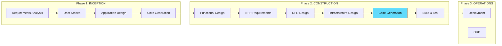
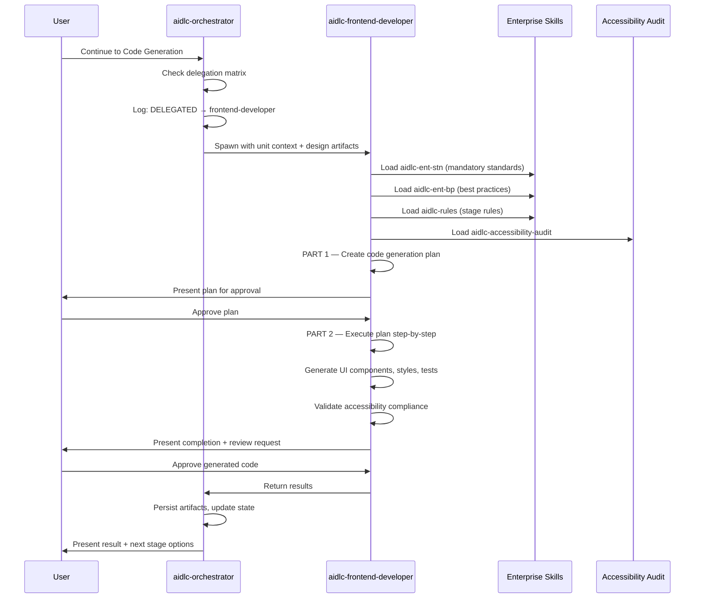
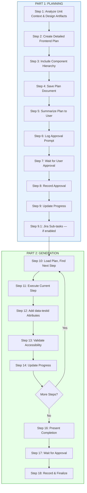
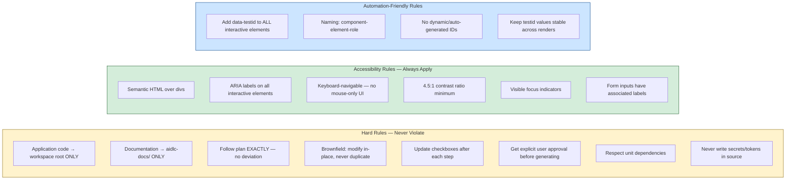
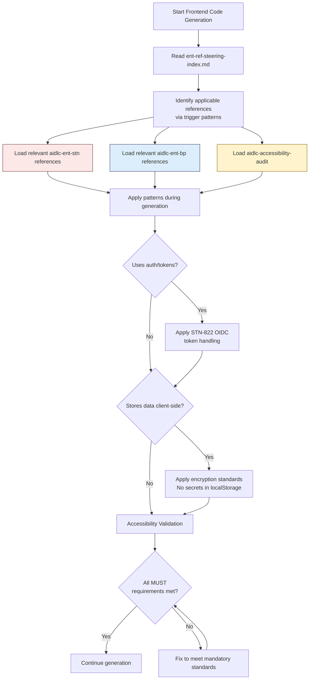
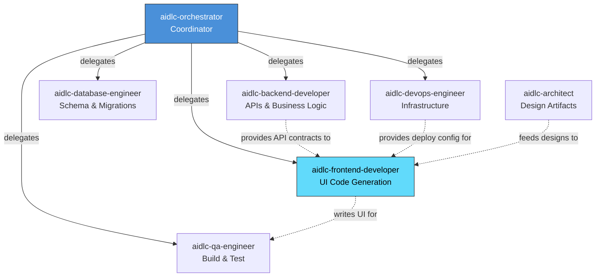
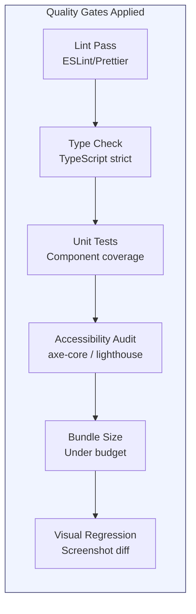
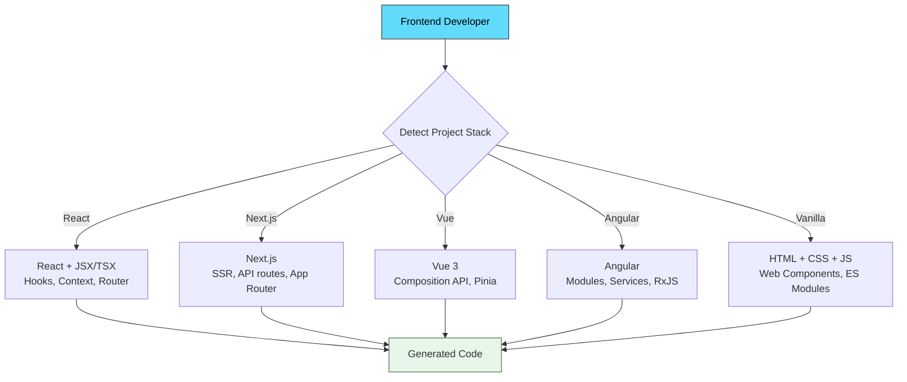

# AIDLC Frontend Developer Agent — Complete Reference

> **Agent ID:** `aidlc-frontend-developer`  
> **Installed In:** Apex (Kiro IDE Extension)  
> **Version:** Defined in `~/.kiro/agents/aidlc-frontend-developer.json`  
> **Author:** architecture-team / aidlc-framework

---

## 1. Overview

The **aidlc-frontend-developer** is a specialist sub-agent within the AI-Driven Development Lifecycle (AI-DLC) framework. It is responsible for generating client-side code — HTML, CSS, JavaScript, React components, responsive layouts, animations, and accessible UI — during the **Construction Phase → Code Generation** stage.

It is **never invoked directly by the user**. The **aidlc-orchestrator** agent delegates work to it when the workflow reaches the Code Generation stage and the unit of work is frontend-scoped.

---

## 2. Agent Configuration

```json
{
  "name": "aidlc-frontend-developer",
  "description": "AI-DLC frontend developer for HTML, CSS, JS, React, accessibility.",
  "prompt": "file://./aidlc-frontend-developer.md",
  "tools": ["read", "write", "shell"],
  "allowedTools": ["read"],
  "resources": [
    "file://.kiro/steering/**/*.md",
    "skill://.kiro/skills/**/SKILL.md",
    "file://~/.kiro/steering/**/*.md",
    "skill://~/.kiro/skills/**/SKILL.md"
  ]
}
```

| Property | Value | Purpose |
|----------|-------|---------|
| `tools` | `read`, `write`, `shell` | Can read files, write code, run shell commands |
| `allowedTools` | `read` | Auto-approved without user confirmation |
| `resources` | Workspace + user steering & skills | Access to all enterprise rules and project context |

---

## 3. Role & Responsibilities

```
┌─────────────────────────────────────────────────┐
│         AIDLC Frontend Developer                │
├─────────────────────────────────────────────────┤
│ • Generate HTML, CSS, JavaScript from design    │
│   artifacts                                     │
│ • Build responsive, accessible, performant UI   │
│   components                                    │
│ • Implement React/framework-based UIs           │
│ • Add animations, transitions, interactive      │
│   features                                      │
│ • Ensure semantic HTML & ARIA compliance        │
│ • Implement keyboard navigation & focus mgmt    │
│ • Validate colour contrast (WCAG 2.1 AA)       │
│ • Add data-testid attributes for automation     │
│ • Apply enterprise standards (MUST) & best      │
│   practices (SHOULD) to frontend code           │
│ • Follow approved code generation plan exactly  │
└─────────────────────────────────────────────────┘
```

---

## 4. Position in the AI-DLC Lifecycle



> The **Frontend Developer** agent is activated at the **Code Generation** stage (highlighted above). It executes only after Functional Design, NFR Design, and Infrastructure Design are complete for the unit.

---

## 5. Invocation & Delegation Flow



---

## 6. Two-Part Execution Workflow



---

## 7. Skills & Steering Files Used

### 7.1 Skills Loaded at Runtime

```mermaid
graph TD
    FD[aidlc-frontend-developer] --> ENT_STN[aidlc-ent-stn
Enterprise Standards]
    FD --> ENT_BP[aidlc-ent-bp
Enterprise Best Practices]
    FD --> RULES[aidlc-rules
Stage Rules]
    FD --> A11Y[aidlc-accessibility-audit
Accessibility Audit]

    ENT_STN --> STN1[ent-stn-iam.md
Identity & Access Mgmt]
    ENT_STN --> STN2[ent-stn-secrets.md
Secrets Management]
    ENT_STN --> STN3[ent-stn-encryption.md
Encryption Standards]
    ENT_STN --> STN4[ent-stn-logging.md
Logging & Monitoring]
    ENT_STN --> STN5[ent-stn-environments.md
Environment Separation]
    ENT_STN --> STN6[ent-stn-devops.md
CI/CD Standards]
    ENT_STN --> STN7[arch-stn-822-iam.md
STN-822 Okta/OIDC]
    ENT_STN --> STN8[arch-stn-828-data.md
STN-828 Data Architecture]
    ENT_STN --> STN9[arch-stn-cloud-aws.md
AWS Cloud Standards]
    ENT_STN --> STN10[arch-stn-aws-services.md
AWS IaC Standards]

    ENT_BP --> BP1[api-design.md]
    ENT_BP --> BP2[containers.md]
    ENT_BP --> BP3[observability.md]
    ENT_BP --> BP4[resiliency.md]
    ENT_BP --> BP5[healthchecks.md]
    ENT_BP --> BP6[integration-testing.md]

    RULES --> CG[construction/code-generation.md]

    A11Y --> AC1[Semantic HTML]
    A11Y --> AC2[Keyboard Navigation]
    A11Y --> AC3[Colour & Contrast]

    style FD fill:#61dafb,stroke:#333,color:#000
    style ENT_STN fill:#fde8e8,stroke:#633
    style ENT_BP fill:#dceefb,stroke:#336
    style RULES fill:#e8f5e9,stroke:#363
    style A11Y fill:#fff3cd,stroke:#856404
```



### 7.2 Skill Details

| Skill | Type | Purpose | Relevance to Frontend |
|-------|------|---------|----------------------|
| `aidlc-ent-stn` | Standards (MUST) | Mandatory requirements for IAM/Okta, secrets, encryption, logging, CI/CD | Token handling, OIDC flows, secure storage, CSP headers |
| `aidlc-ent-bp` | Best Practices (SHOULD) | Recommended patterns for API design, observability, resiliency | Error handling, health checks, retry logic on API calls |
| `aidlc-rules` | Stage Rules | Code generation workflow steps, checkboxes, approval gates | Governs plan structure, progress tracking, approval flow |
| `aidlc-accessibility-audit` | Accessibility (WCAG) | Semantic HTML, ARIA, keyboard navigation, colour contrast | Core to every UI component generated |

### 7.3 Accessibility Audit Skill — Detail

The `aidlc-accessibility-audit` skill is uniquely associated with the frontend developer agent (metadata: `agents: frontend-developer, qa-engineer`). It enforces:

| Area | Requirements |
|------|-------------|
| **Semantic HTML** | Proper heading hierarchy (h1→h2→h3), landmark elements (nav, main, aside, footer), lists for navigation |
| **Keyboard Navigation** | All interactive elements focusable, tab order follows visual layout, visible focus indicators, Escape closes modals |
| **Colour & Contrast** | 4.5:1 minimum for normal text, 3:1 minimum for large text (WCAG 2.1 AA) |
| **ARIA** | Proper roles, labels, descriptions; live regions for dynamic content |
| **Screen Readers** | Content order matches visual order, alt text on images, form labels associated |

### 7.4 Steering Files Accessible

The agent has access to all steering files at both levels:

| Scope | Path Pattern | Content |
|-------|-------------|---------|
| Workspace | `.kiro/steering/**/*.md` | Project-specific context (tech stack, structure, product domain) |
| User/Global | `~/.kiro/steering/**/*.md` | Cross-project enterprise rules |

**Current workspace steering files available:**

| File | Content |
|------|---------|
| `tech.md` | Tech stack, commands, reporting pattern, environment config |
| `structure.md` | Project layout, naming conventions, isolation rules |
| `PRODUCT.md` | ETC/GTN/JETS domain context, trade flow, markets |
| `matching-context.md` | Market matching specific context |
| `uft-native-methods.md` | UFT native method references |

---

## 8. Code Generation Plan Structure

When the frontend developer creates a plan, it produces a document at:
```
aidlc-docs/construction/plans/{unit-name}-code-generation-plan.md
```

The plan contains these sequential steps (each with `[ ]` checkboxes):

| Step | Activity | Output |
|------|----------|--------|
| 1 | Project Structure Setup (greenfield only) | Directory skeleton, package.json, build config |
| 2 | Component Architecture | Component tree, props/state design |
| 3 | Base Layout & Routing | App shell, router config, page containers |
| 4 | Shared UI Components | Buttons, inputs, modals, cards (design system) |
| 5 | Feature Components | Business-logic UI, forms, data displays |
| 6 | Styling & Responsive Design | CSS/SCSS modules, breakpoints, theme |
| 7 | Animations & Transitions | Micro-interactions, loading states |
| 8 | State Management | Context/Redux/Zustand setup, API hooks |
| 9 | API Integration Layer | Service files, fetch hooks, error handling |
| 10 | Accessibility Hardening | ARIA, keyboard, focus management, contrast |
| 11 | Testing Automation Attributes | `data-testid` on all interactive elements |
| 12 | Unit/Component Tests | Test files for components |
| 13 | Documentation | Component docs, Storybook stories |
| 14 | Build & Deployment Artifacts | Dockerfile, CI config, env handling |

---

## 9. Critical Rules & Constraints



### `data-testid` Naming Convention

```
data-testid="<component>-<element>-<role>"
```

**Examples:**
- `data-testid="login-form-submit-button"`
- `data-testid="trade-book-filter-dropdown"`
- `data-testid="order-input-quantity-field"`
- `data-testid="nav-sidebar-toggle"`

### Code Location Rules by Project Type

| Project Type | Code Location | Tests Location |
|--------------|--------------|----------------|
| Brownfield | Existing structure (`src/components/`, `app/`, etc.) | Existing test dirs |
| Greenfield Single Unit | `src/`, `tests/`, `public/` at workspace root | `tests/` or `__tests__/` |
| Greenfield Multi-Unit (Microfrontends) | `{unit-name}/src/` | `{unit-name}/tests/` |
| Greenfield Multi-Unit (Monolith) | `src/{unit-name}/` | `tests/{unit-name}/` |

---

## 10. Enterprise Compliance Check Flow (Frontend-Specific)



### Frontend-Relevant Enterprise Standards (MUST)

| Standard | Frontend Application |
|----------|---------------------|
| `ent-stn-iam.md` | OIDC token handling, secure redirects, session management, PKCE flow |
| `ent-stn-secrets.md` | No secrets in client bundles, use environment injection at build time |
| `ent-stn-encryption.md` | TLS-only API calls, no sensitive data in localStorage, CSP headers |
| `ent-stn-logging.md` | Structured client-side logging, no PII in console/network payloads |
| `ent-stn-devops.md` | Build pipeline standards, quality gates (lint, test, scan) |
| `arch-stn-822-iam.md` | Okta-specific: approved JS/React OIDC libraries, scope naming |

### Frontend-Relevant Best Practices (SHOULD)

| Practice | Frontend Application |
|----------|---------------------|
| `api-design.md` | Consistent error display, rate-limit awareness in UI |
| `observability.md` | Client-side telemetry, performance marks, error boundaries |
| `resiliency.md` | Retry logic on API failures, offline-first patterns, graceful degradation |
| `healthchecks.md` | Frontend health endpoint for monitoring |
| `integration-testing.md` | E2E test categories, visual regression |

---

## 11. Interaction with Other Agents



| Upstream Agent | What It Provides to Frontend Developer |
|----------------|---------------------------------------|
| `aidlc-architect` | Application design, wireframes, component diagrams, UI patterns |
| `aidlc-backend-developer` | API contracts (REST/GraphQL), service interfaces, DTO shapes |
| `aidlc-devops-engineer` | CDN config, environment variables, build pipeline specs |

| Downstream Agent | What Frontend Developer Provides |
|-----------------|--------------------------------|
| `aidlc-qa-engineer` | Generated components + tests for build verification, `data-testid` map |
| `aidlc-backend-developer` | UI requirements that inform API shape (if iterating) |

---

## 12. Frontend-Specific Quality Gates



| Gate | Tool | Threshold |
|------|------|-----------|
| Lint | ESLint + Prettier | Zero errors, zero warnings |
| Types | TypeScript (strict mode) | Zero compile errors |
| Tests | Jest / Vitest + RTL | All pass, coverage per plan |
| A11y | axe-core | Zero violations (WCAG 2.1 AA) |
| Bundle | Webpack/Vite analyzer | Within defined budget |
| Visual | Chromatic / Percy | No unexpected diffs |

---

## 13. Technology Stack Awareness

The frontend developer agent adapts its output based on the project's detected stack:



**Stack detection sources:**
- `package.json` → framework dependencies
- `tsconfig.json` → TypeScript configuration
- `vite.config.*` / `webpack.config.*` → build tooling
- Existing `src/` structure and file extensions

---

## 14. Completion Criteria

The frontend developer agent marks its work as **complete** when ALL of these are true:

- [x] Complete code generation plan created and approved by user
- [x] All steps in the plan marked `[x]` (no remaining `[ ]`)
- [x] All UI components generated per design specification
- [x] Responsive design implemented (mobile-first breakpoints)
- [x] Accessibility audit passed (semantic HTML, ARIA, keyboard, contrast)
- [x] `data-testid` attributes on all interactive elements
- [x] Unit/component tests generated
- [x] Build artifacts produced (if applicable)
- [x] `aidlc-state.md` updated with completion status
- [x] `journal.md` logged with approval timestamp

---

## 15. Summary

The `aidlc-frontend-developer` is a disciplined, accessibility-first, plan-driven UI code generation agent that:

1. **Never freelances** — it follows an approved plan exactly, step by step
2. **Never produces without approval** — both the plan and the output require explicit user sign-off
3. **Accessibility is non-negotiable** — WCAG 2.1 AA compliance is baked into every component via the `aidlc-accessibility-audit` skill
4. **Automation-friendly from day one** — `data-testid` attributes are added systematically using the `component-element-role` naming pattern
5. **Applies enterprise governance** — mandatory standards (MUST) and recommended patterns (SHOULD) are loaded before any code is written
6. **Generates complete UI units** — components + styles + state + API integration + tests + docs
7. **Supports brownfield and greenfield** — modifies existing UI in-place or creates new frontend structures
8. **Maintains traceability** — every generated file maps back to a user story and a plan step
9. **Framework-agnostic** — adapts output to React, Vue, Angular, Next.js, or vanilla JS based on project detection

---

*Generated: June 4, 2026 | Source: `~/.kiro/agents/aidlc-frontend-developer.json` + `aidlc-frontend-developer.md`* 