​# AIDLC Orchestrator Agent — Complete Reference


> **Agent ID:** `aidlc-orchestrator`  

> **Installed In:** Apex (Kiro IDE Extension)  

> **Version:** Defined in `~/.kiro/agents/aidlc-orchestrator.json`  

> **Author:** architecture-team / aidlc-framework


---


## 1. Overview


The **aidlc-orchestrator** is the **central coordinating agent** within the AI-Driven Development Lifecycle (AI-DLC) framework. It is the only agent that interacts directly with the user by default — all other specialist agents are spawned by and report back to the orchestrator.


Its primary responsibilities are:

- Managing the three-phase lifecycle (Inception → Construction → Operations)

- Routing work to the correct specialist agent based on the current stage

- Maintaining workflow state (`aidlc-state.md`)

- Enforcing governance gates and stage transitions

- Logging all decisions and transitions to `journal.md`

- Handling session continuity (pause, resume, skip)


The orchestrator is **invoked directly by the user** — it is the entry point to the AI-DLC workflow. When a user says "start the AIDLC" or triggers a spec-based workflow, the orchestrator takes control.


---


## 2. Agent Configuration


```json

{

  "name": "aidlc-orchestrator",

  "description": "AI-DLC workflow orchestrator. Routes work to specialist agents based on the current AI-DLC phase and stage.",

  "prompt": "file://./aidlc-orchestrator.md",

  "tools": ["read", "write", "shell", "web", "spec"],

  "allowedTools": ["read"],

  "resources": [

    "file://.kiro/steering/**/*.md",

    "skill://.kiro/skills/**/SKILL.md",

    "file://~/.kiro/steering/**/*.md",

    "skill://~/.kiro/skills/**/SKILL.md"

  ]

}

```


| Property | Value | Purpose |

|----------|-------|---------|

| `tools` | `read`, `write`, `shell`, `web`, `spec` | Full tool access — reads files, writes state/docs, runs commands, accesses web, manages specs |

| `allowedTools` | `read` | Auto-approved without user confirmation |

| `resources` | Workspace + user steering & skills | Access to all enterprise rules, project context, and skill definitions |


---


## 3. Role & Responsibilities


```

┌──────────────────────────────────────────────────────────────────┐

│                    AIDLC Orchestrator                             │

├──────────────────────────────────────────────────────────────────┤

│ • Entry point for all AI-DLC workflow sessions                   │

│ • Present welcome message and collect session objective          │

│   (Explore vs Deliver)                                           │

│ • Determine governance mode (Active vs Shadow)                   │

│ • Manage workspace detection (greenfield/brownfield assessment)  │

│ • Route work to specialist agents via delegation matrix          │

│ • Enforce stage-gate transitions (plan→validate→execute cycle)   │

│ • Maintain aidlc-state.md (current phase, stage, progress)       │

│ • Write all decisions and transitions to journal.md              │

│ • Handle session continuity (pause/resume/skip)                  │

│ • Coordinate governance checks across stages                     │

│ • Present aggregated results from specialist agents to user      │

│ • Manage opt-in rule activation during requirements stage        │

│ • Enforce artefact location rules (code vs docs separation)      │

│ • Handle mid-workflow changes (objective switch, mode switch)     │

│ • Process user overrides at governance gates                     │

│ • Coordinate multi-unit construction (sequential unit execution) │

│ • Compile Operational Readiness Pack (ORP) in operations phase   │

└──────────────────────────────────────────────────────────────────┘

```


---


## 4. Position in the AI-DLC Lifecycle


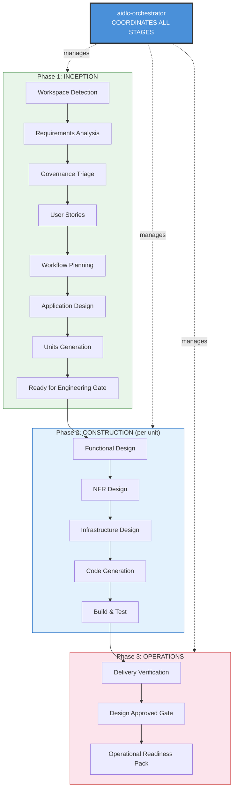


> The **Orchestrator** sits above all three phases. It does not execute the work itself — it coordinates, delegates, validates, and records.


---


## 5. Core Workflow — The Plan→Validate→Execute Cycle


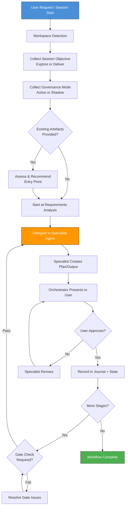


---


## 6. Delegation Matrix — Agent Routing


The orchestrator uses a delegation matrix to determine which specialist agent handles each stage:


```mermaid

graph TD

    ORCH[aidlc-orchestrator] -->|Inception: Requirements| RA[aidlc-requirements-analyst]

    ORCH -->|Inception: User Stories| PO[aidlc-product-owner]

    ORCH -->|Inception: Application Design| ARCH[aidlc-architect]

    ORCH -->|Construction: Code Gen — Frontend| FE[aidlc-frontend-developer]

    ORCH -->|Construction: Code Gen — Backend| BE[aidlc-backend-developer]

    ORCH -->|Construction: Code Gen — Database| DBE[aidlc-database-engineer]

    ORCH -->|Construction: Infrastructure| DEVOPS[aidlc-devops-engineer]

    ORCH -->|Construction: Build & Test| QA[aidlc-qa-engineer]

    ORCH -->|Operations: Security Review| SEC[aidlc-security-engineer]

    ORCH -->|Operations: SRE & Monitoring| SRE[aidlc-sre-engineer]

    ORCH -->|Any Stage: Documentation| TW[aidlc-technical-writer]

    ORCH -->|Any Stage: Jira Integration| JW[aidlc-jira-writer]

    ORCH -->|Any Stage: Doc Writing| DW[aidlc-doc-writer]



    style ORCH fill:#4a90d9,stroke:#333,color:#fff,stroke-width:3px

    style RA fill:#ab47bc,stroke:#333,color:#fff

    style PO fill:#7e57c2,stroke:#333,color:#fff

    style ARCH fill:#5c6bc0,stroke:#333,color:#fff

    style FE fill:#61dafb,stroke:#333,color:#000

    style BE fill:#68d391,stroke:#333,color:#000

    style DBE fill:#f6ad55,stroke:#333,color:#000

    style DEVOPS fill:#fc8181,stroke:#333,color:#000

    style QA fill:#4fd1c5,stroke:#333,color:#000

    style SEC fill:#f56565,stroke:#333,color:#fff

    style SRE fill:#ed8936,stroke:#333,color:#000

    style TW fill:#a0aec0,stroke:#333,color:#000

    style JW fill:#63b3ed,stroke:#333,color:#000

    style DW fill:#b794f4,stroke:#333,color:#000

```


### Delegation Decision Logic


| Stage | Condition | Agent Delegated To |

|-------|-----------|-------------------|

| Requirements Analysis | Always | `aidlc-requirements-analyst` |

| User Stories | Conditional (not trivial changes) | `aidlc-product-owner` |

| Application Design | Conditional (material changes) | `aidlc-architect` |

| Units Generation | Conditional (multi-component work) | `aidlc-architect` |

| Functional Design | Conditional (complex logic) | `aidlc-architect` |

| NFR Design | Conditional (NFRs identified) | `aidlc-architect` |

| Infrastructure Design | Always | `aidlc-devops-engineer` |

| Code Generation — Frontend | Unit is frontend-scoped | `aidlc-frontend-developer` |

| Code Generation — Backend | Unit is backend-scoped | `aidlc-backend-developer` |

| Code Generation — Database | Unit is data-layer-scoped | `aidlc-database-engineer` |

| Build & Test | Always (after all units) | `aidlc-qa-engineer` |

| Security Review | On-demand or governance-triggered | `aidlc-security-engineer` |

| Delivery Verification | Always | Orchestrator (internal) |

| Operational Readiness Pack | Always | Orchestrator + `aidlc-sre-engineer` |


---


## 7. Skills & Steering Files Used


### 7.1 Skills Loaded at Runtime


```mermaid

graph TD

    ORCH[aidlc-orchestrator] --> WORKFLOW[aidlc-workflow<br/>Lifecycle Workflow Rules]

    ORCH --> RULES[aidlc-rules<br/>Stage Rules & Governance]

    ORCH --> GUIDE[aidlc-guide<br/>Process Explanations]

    ORCH --> ENT_STN[aidlc-ent-stn<br/>Enterprise Standards]

    ORCH --> ENT_BP[aidlc-ent-bp<br/>Enterprise Best Practices]


    WORKFLOW --> WF1[Three-Phase Lifecycle<br/>Inception → Construction → Operations]

    WORKFLOW --> WF2[Core Pattern<br/>Plan → Validate → Execute]

    WORKFLOW --> WF3[Session Continuity<br/>Pause/Resume/Skip]

    WORKFLOW --> WF4[State Management<br/>aidlc-state.md + journal.md]


    RULES --> R_COMMON[Common Rules<br/>Always loaded at start]

    RULES --> R_INCEPTION[Inception Stage Rules]

    RULES --> R_CONSTRUCTION[Construction Stage Rules]

    RULES --> R_OPERATIONS[Operations Stage Rules]

    RULES --> R_OPTIN[Opt-In Governance Rules]


    GUIDE --> G1[Process Questions<br/>"How does this work?"]

    GUIDE --> G2[Stage Explanations<br/>"What stage am I at?"]

    GUIDE --> G3[Governance Help<br/>"What governance applies?"]


    ENT_STN --> S1[IAM / Okta / OIDC]

    ENT_STN --> S2[Secrets Management]

    ENT_STN --> S3[Encryption Standards]

    ENT_STN --> S4[Logging & Monitoring]

    ENT_STN --> S5[Environment Separation]

    ENT_STN --> S6[CI/CD Standards]

    ENT_STN --> S7[AWS Cloud Architecture]


    ENT_BP --> B1[API Design]

    ENT_BP --> B2[Observability]

    ENT_BP --> B3[Resiliency]

    ENT_BP --> B4[Health Checks]

    ENT_BP --> B5[Integration Testing]

    ENT_BP --> B6[Container Security]


    style ORCH fill:#4a90d9,stroke:#333,color:#fff,stroke-width:3px

    style WORKFLOW fill:#c8e6c9,stroke:#2e7d32

    style RULES fill:#e8f5e9,stroke:#2e7d32

    style GUIDE fill:#fff9c4,stroke:#f57f17

    style ENT_STN fill:#fde8e8,stroke:#633

    style ENT_BP fill:#dceefb,stroke:#336

```


### 7.2 Skill Detail Table


| Skill | Type | When Loaded | Purpose |

|-------|------|-------------|---------|

| `aidlc-workflow` | Core Workflow | Session start (always) | Defines the three-phase lifecycle, core plan→validate→execute pattern, state management, and session continuity rules |

| `aidlc-rules` | Stage Rules | Per-stage (progressive) | Stage-specific rules loaded on demand: workspace-detection, requirements-analysis, governance-triage, code-generation, etc. Includes opt-in governance rule definitions |

| `aidlc-guide` | Process Guide | On user questions | Answers process/governance questions conversationally — "What stage am I at?", "What is an ADB?", "Can I skip this?" |

| `aidlc-ent-stn` | Enterprise Standards (MUST) | At governance checks & design stages | Mandatory TP ICAP architecture standards — IAM, secrets, encryption, logging, CI/CD, STN-822, STN-828, AWS cloud |

| `aidlc-ent-bp` | Enterprise Best Practices (SHOULD) | At design & code generation stages | Recommended patterns — API design, observability, resiliency, health checks, containers, testing |


### 7.3 Additional Skills Available for Delegation


The orchestrator does not load these directly but ensures they are available to specialist agents:


| Skill | Used By | Purpose |

|-------|---------|---------|

| `aidlc-accessibility-audit` | `aidlc-frontend-developer`, `aidlc-qa-engineer` | WCAG 2.1 AA compliance validation |

| `aidlc-adr-writing` | `aidlc-architect` | Architecture Decision Record templates and patterns |

| `aidlc-ddd-modeling` | `aidlc-architect` | Domain-Driven Design patterns (aggregates, bounded contexts) |

| `aidlc-doc-writing` | `aidlc-doc-writer`, `aidlc-technical-writer` | Documentation templates and style guide |

| `aidlc-jira-writing` | `aidlc-jira-writer` | Jira ticket templates (stories, bugs, tasks, epics) |


### 7.4 Steering Files Accessible


The orchestrator has access to all steering files and passes relevant context to delegated agents:


| Scope | Path Pattern | Content |

|-------|-------------|---------|

| Workspace | `.kiro/steering/**/*.md` | Project-specific context (tech stack, structure, product domain) |

| User/Global | `~/.kiro/steering/**/*.md` | Cross-project enterprise rules |


### 7.5 Rules Reference Files (Progressive Disclosure)


The orchestrator loads rules progressively — only the rules relevant to the current stage are loaded to conserve context:


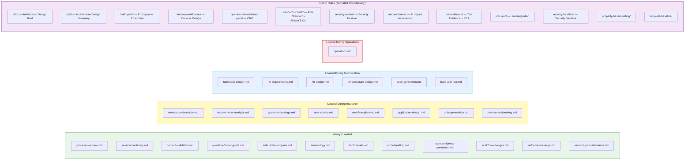


---


## 8. Governance Management


### 8.1 Governance Modes


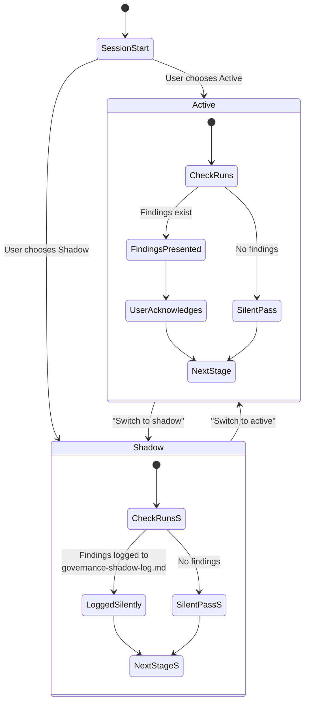


### 8.2 Governance Gates Managed


| Gate | When Checked | Blocking in Deliver? |

|------|-------------|---------------------|

| **CMF** (Change Management Forum) | Governance Triage | Advisory |

| **Technology Triage** | Governance Triage | Advisory |

| **Procurement / IRM** | Governance Triage (flagged early) | Can block if vendor-dependent |

| **SAF** (Solution Authority Forum) | Application Design / Ready for Engineering Gate | Yes — design must be approved |

| **AI Governance** | Governance Triage (if AI/ML in scope) | Yes |

| **Standards-Check** | Every ADR written (always-on) | Advisory in Explore, directive in Deliver |

| **PtO** (Permit to Operate) | Operations phase | Yes — must pass before go-live |

| **CAB** (Change Approval Board) | Operations phase | Yes — must pass before production |


### 8.3 Always-Flagged Categories (Even in Explore Mode)


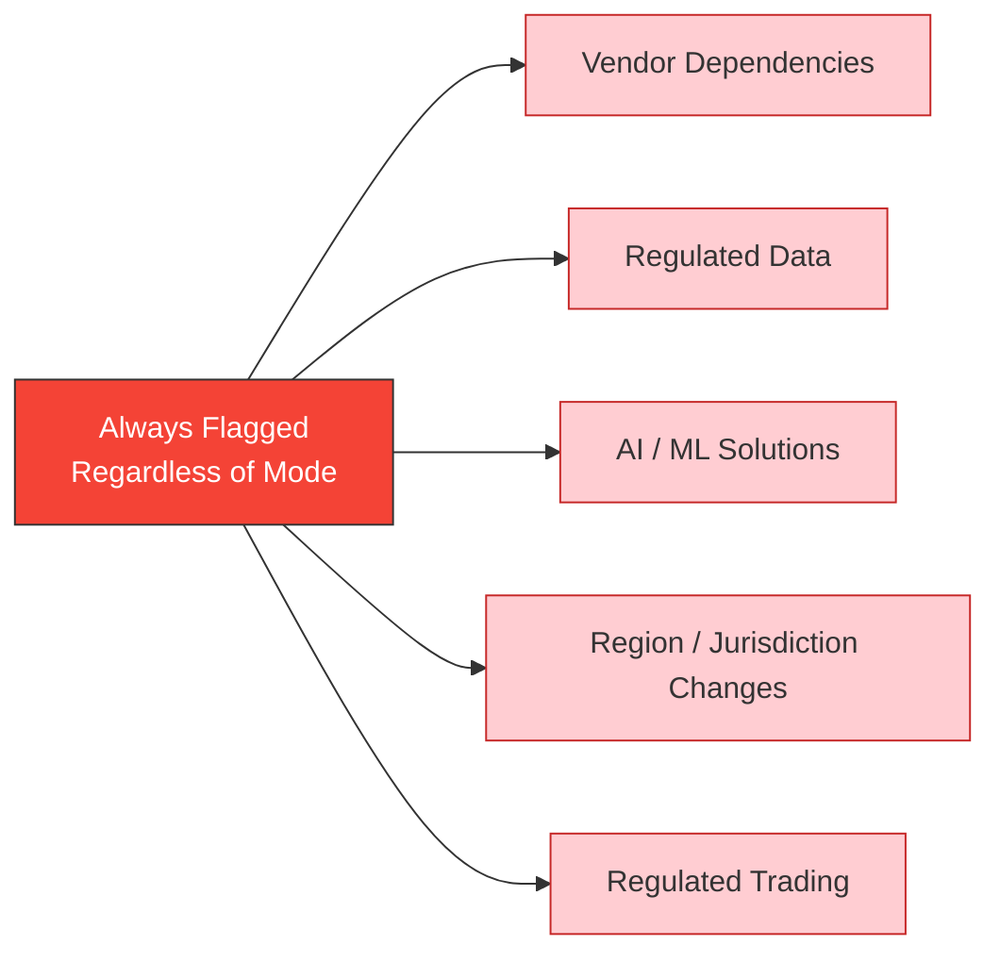


---


## 9. State Management


### 9.1 State File — `aidlc-docs/aidlc-state.md`


The orchestrator maintains a single state file that tracks the entire session:


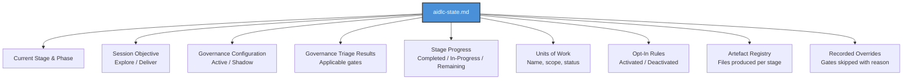


### 9.2 Journal — `aidlc-docs/journal.md`


Every significant event is logged:


| Event Type | What's Recorded |

|-----------|-----------------|

| Stage transition | From → To, timestamp, reason |

| Delegation | Agent spawned, context provided |

| User approval | What was approved, timestamp |

| Governance finding | Category, severity, recommendation |

| Override | What was overridden, user's reason |

| Session pause/resume | State at pause, state at resume |

| Opt-in activation | Rule activated, trigger |

| Skip | What was skipped, downstream implications |


---


## 10. Session Lifecycle Management


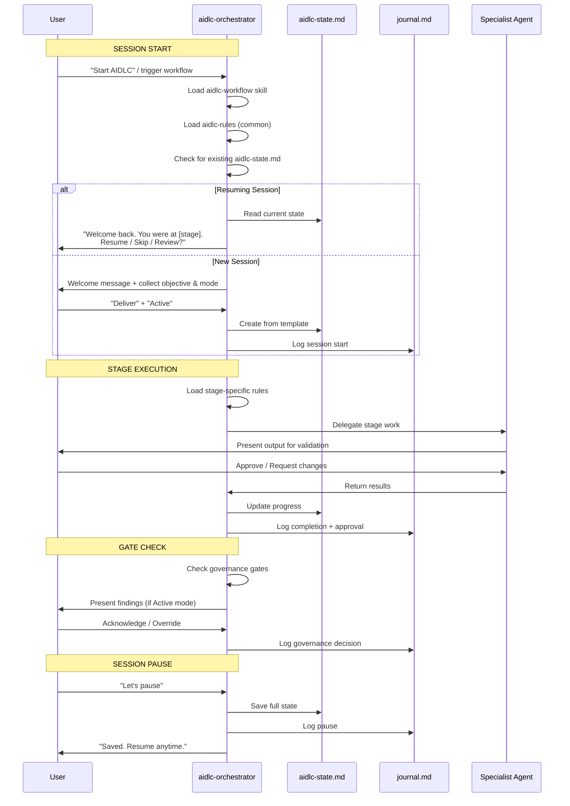


---


## 11. Delegation Pattern — How Work Is Routed


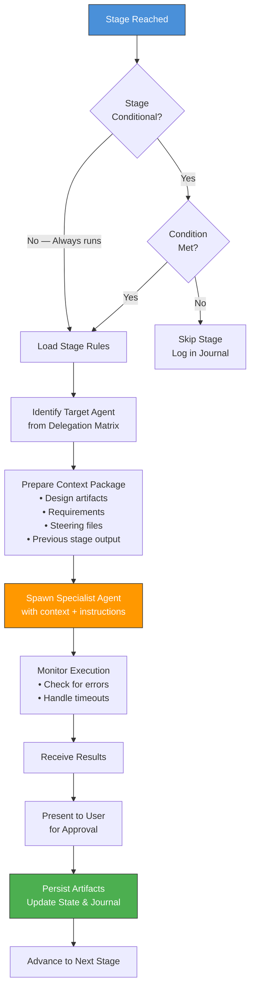


---


## 12. Adaptive Depth Levels


The orchestrator adjusts workflow depth based on the complexity of the user's request:


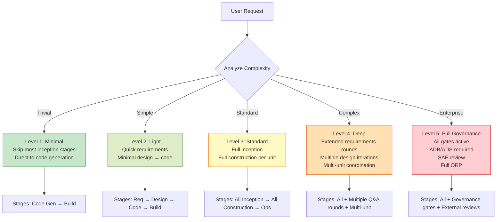


---


## 13. Multi-Unit Construction Coordination


When the architect produces multiple units of work, the orchestrator sequences their execution:


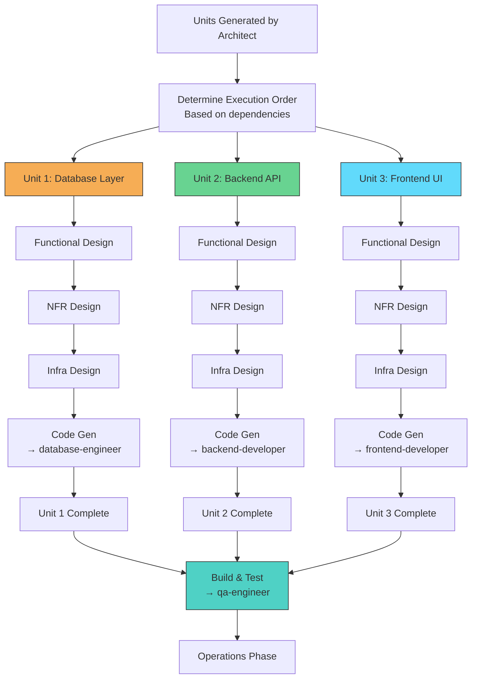


---


## 14. Interaction with All Other Agents


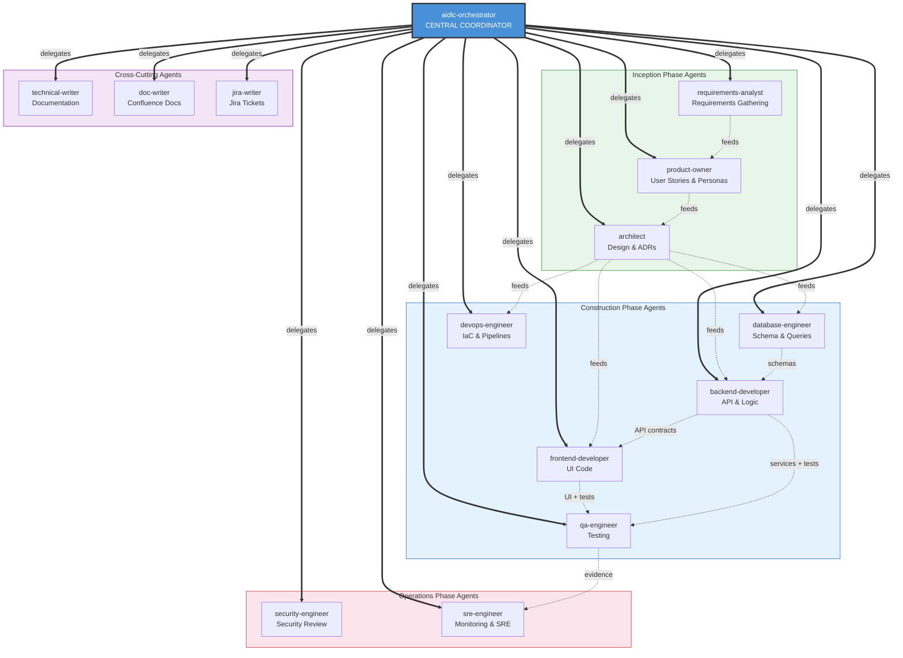


---


## 15. Session Objective Comparison


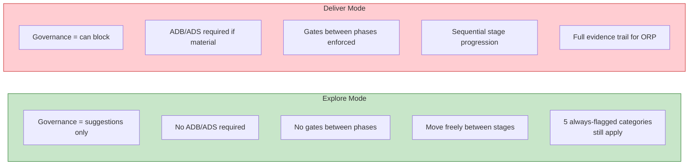


| Aspect | Explore | Deliver |

|--------|---------|---------|

| Purpose | Prototyping, validation, PoC | Production-bound development |

| Governance findings | Suggestions — non-blocking | Advise, direct, or block based on severity |

| Design documents | Not required | Required if change is material |

| Stage gates | None — free movement | Enforced (design review, verification) |

| ORP generation | Not generated | Generated in operations phase |

| Switch allowed? | Yes, at any time | Yes, at any time |


---


## 16. Critical Rules & Constraints


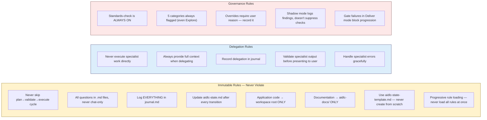


---


## 17. Error Recovery & Edge Cases


| Scenario | Orchestrator Response |

|----------|----------------------|

| Specialist agent fails | Log error → retry once → if still fails, present error to user with options |

| User provides existing artefacts | Assess coverage → recommend entry point → allow skip/start-fresh |

| Mid-session objective switch | Update state → recalculate applicable governance → inform user of implications |

| User requests skip | Allow → log skip → inform of downstream checks that will still run |

| Session context compacted | Re-read `aidlc-state.md` → confirm position → continue from last recorded state |

| Conflicting requirements | Flag contradiction → ask user to resolve → record decision |

| Governance check fails in Shadow mode | Log silently → continue → present summary if user asks |


---


## 18. Artefact Registry — What Gets Produced


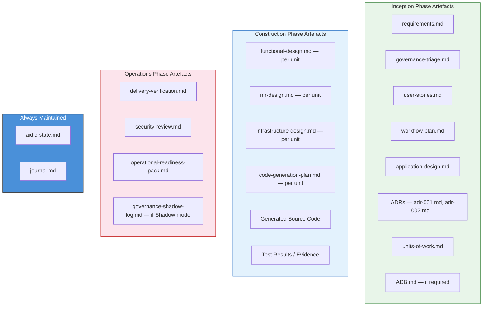


All artefacts are stored under `aidlc-docs/` with this structure:

```

aidlc-docs/

├── aidlc-state.md

├── journal.md

├── inception/

│   ├── requirements.md

│   ├── governance-triage.md

│   ├── user-stories.md

│   ├── workflow-plan.md

│   ├── application-design.md

│   ├── adrs/

│   │   ├── adr-001.md

│   │   └── ...

│   └── units-of-work.md

├── construction/

│   ├── plans/

│   │   ├── {unit}-code-generation-plan.md

│   │   └── ...

│   ├── designs/

│   │   ├── {unit}-functional-design.md

│   │   ├── {unit}-nfr-design.md

│   │   └── {unit}-infrastructure-design.md

│   └── evidence/

│       └── test-results.md

└── operations/

    ├── delivery-verification.md

    ├── security-review.md

    └── operational-readiness-pack.md

```


---


## 19. Comparison with Other Agents


| Aspect | Orchestrator | Specialist Agents |

|--------|-------------|-------------------|

| User interaction | **Direct** — primary point of contact | Indirect — spawned by orchestrator |

| Scope | Entire lifecycle | Single stage or skill |

| State management | **Owns** `aidlc-state.md` and `journal.md` | Reports back to orchestrator |

| Governance | **Enforces** gates and checks | Applies standards within their scope |

| Delegation | **Delegates** work to others | Receives delegated work |

| Tools | Full suite (`read`, `write`, `shell`, `web`, `spec`) | Typically `read`, `write`, `shell` |

| Skills loaded | Workflow + Rules + Guide + Enterprise | Stage-specific + Enterprise |

| Lifecycle awareness | Full (all 3 phases) | Stage-local only |


---


## 20. Summary


The `aidlc-orchestrator` is the **brain of the AI-DLC framework** — it:


1. **Coordinates everything** — no specialist agent acts without orchestrator delegation

2. **Maintains the single source of truth** — `aidlc-state.md` tracks every decision, `journal.md` logs every event

3. **Enforces the plan→validate→execute cycle** — nothing ships without user approval at every stage

4. **Manages governance intelligently** — adapts between Explore (advisory) and Deliver (blocking), with 5 always-flagged categories that cannot be bypassed

5. **Routes work precisely** — uses a delegation matrix to spawn the exact right specialist for each stage

6. **Handles session continuity** — pause, resume, skip, switch modes — all without losing context

7. **Loads rules progressively** — only the rules for the current stage are loaded, conserving context window

8. **Produces a complete evidence trail** — from requirements through design through code through deployment verification, all traceable and auditable

9. **Supports adaptive depth** — a one-line bug fix gets Level 1 (direct code gen); an enterprise platform gets Level 5 (full governance)

10. **Never executes specialist work directly** — it coordinates, it does not implement


The orchestrator is what makes the AI-DLC a **governed, traceable, resumable workflow** rather than just a collection of independent AI agents.


---


*Generated: June 4, 2026 | Source: `~/.kiro/agents/aidlc-orchestrator.json` + `aidlc-orchestrator.md` + activated skills: `aidlc-workflow`, `aidlc-rules`, `aidlc-guide`*

