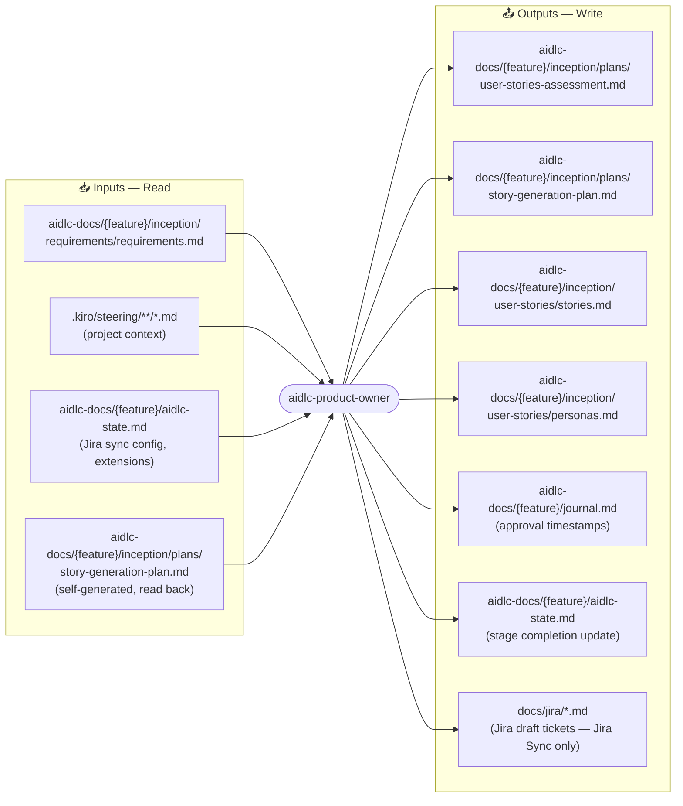
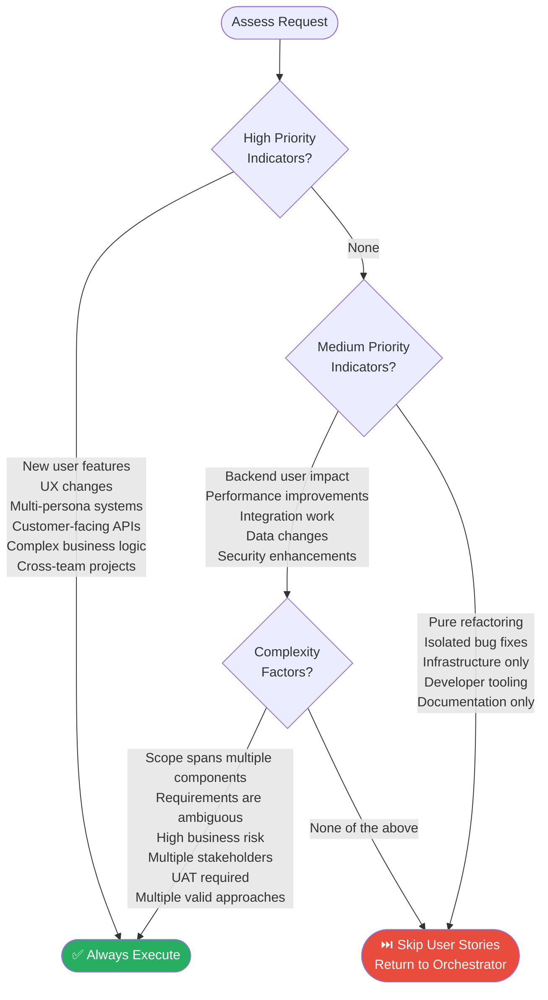
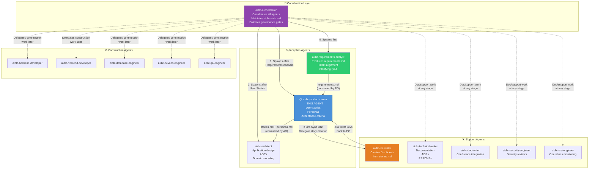
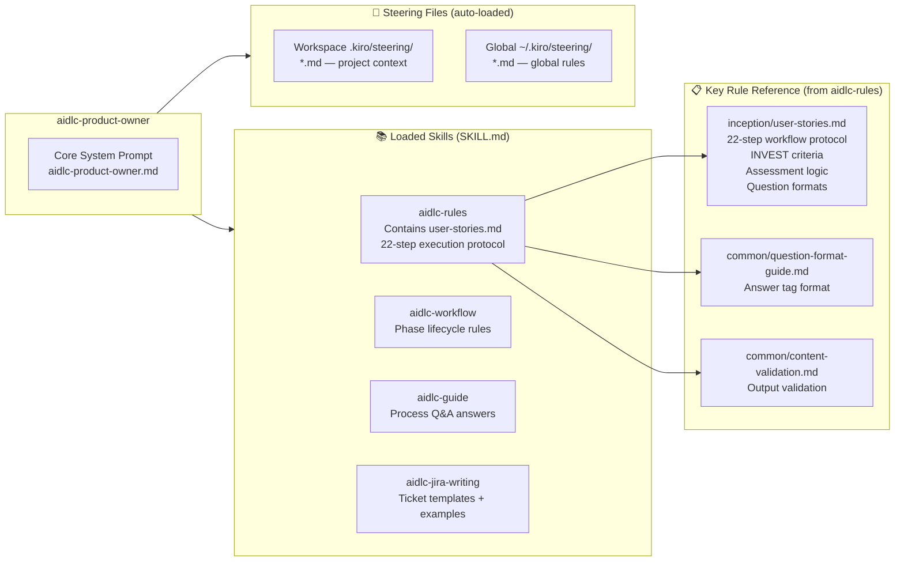
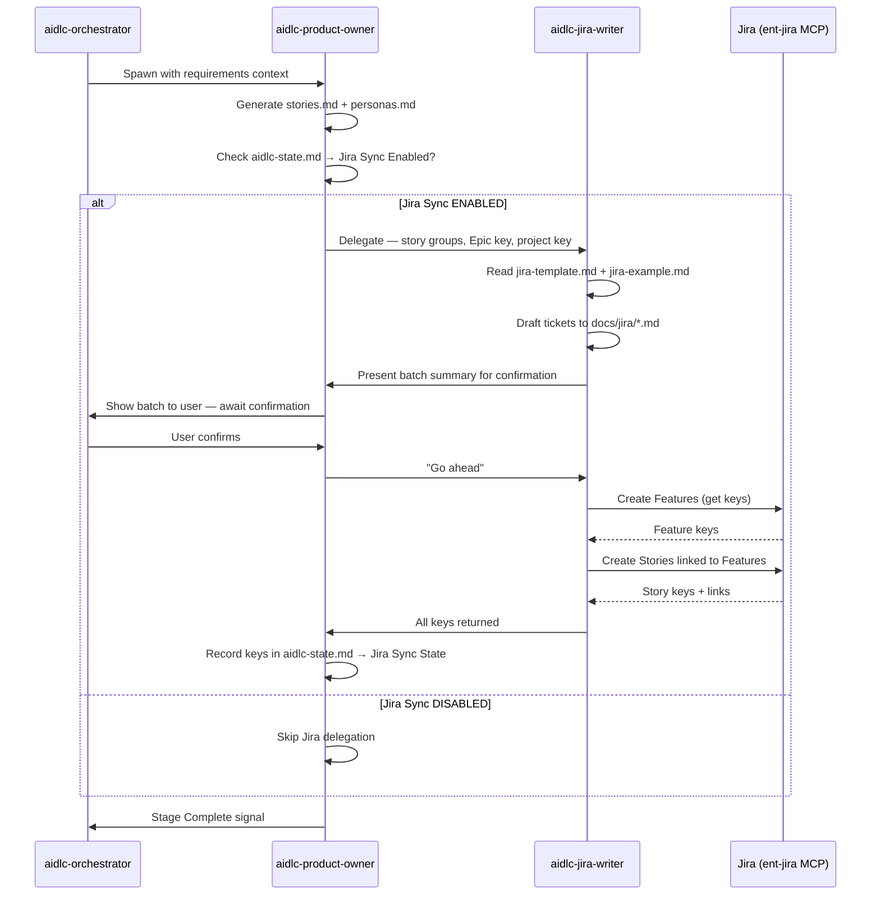
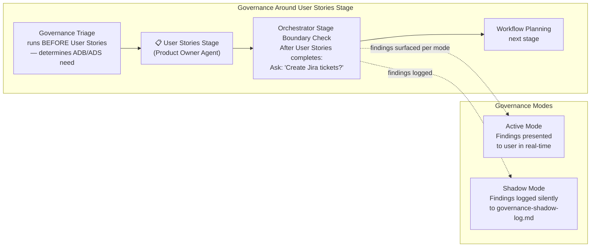
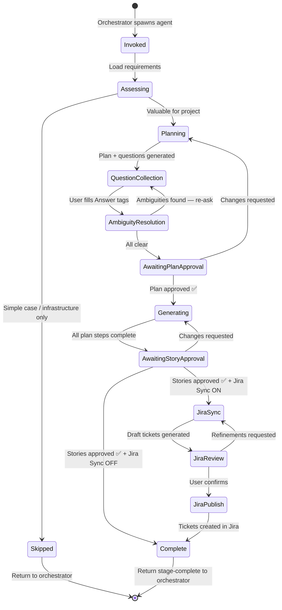

# AIDLC Product Owner Agent — Architecture & Workflow Reference


> **Document Type:** High-Fidelity Agent Architecture Reference  

> **Agent ID:** `aidlc-product-owner`  

> **AI-DLC Phase:** Inception  

> **Stage:** User Stories  

> **Generated:** June 2026


---


## Table of Contents


1. [Agent Overview](#1-agent-overview)

2. [Identity & Configuration](#2-identity--configuration)

3. [Position in the AI-DLC Lifecycle](#3-position-in-the-ai-dlc-lifecycle)

4. [Internal Workflow — Step by Step](#4-internal-workflow--step-by-step)

5. [Artefact Map](#5-artefact-map)

6. [Decision Logic — When to Execute User Stories](#6-decision-logic--when-to-execute-user-stories)

7. [Agent Relationships & Ecosystem](#7-agent-relationships--ecosystem)

8. [Skills & Resources](#8-skills--resources)

9. [Jira Sync Extension](#9-jira-sync-extension)

10. [Governance & Gate Behaviour](#10-governance--gate-behaviour)

11. [Data Flow Diagram](#11-data-flow-diagram)

12. [State Machine](#12-state-machine)

13. [Key Constraints & Rules](#13-key-constraints--rules)


---


## 1. Agent Overview


The **aidlc-product-owner** is a specialist sub-agent within the AI-DLC (AI-Driven Development Lifecycle) framework. It operates exclusively during the **Inception phase, User Stories stage** — positioned between Requirements Analysis and Workflow Planning.


Its core responsibility is to translate validated business requirements into well-structured, INVEST-compliant user stories with defined personas and acceptance criteria. It does **not** write code, designs, or infrastructure. It purely owns the "WHAT users need and WHY" layer.


```

┌─────────────────────────────────────────────────────────────────┐

│  AIDLC INCEPTION PHASE                                          │

│                                                                  │

│  Requirements  ──►  [PRODUCT OWNER]  ──►  Workflow Planning     │

│  Analysis            User Stories          (Orchestrator)        │

│  (Analyst Agent)     Stage                                       │

│                      ↑ THIS AGENT                                │

└─────────────────────────────────────────────────────────────────┘

```


---


## 2. Identity & Configuration


| Property | Value |

|---|---|

| **Agent Name** | `aidlc-product-owner` |

| **JSON Config** | `~/.kiro/agents/aidlc-product-owner.json` |

| **System Prompt** | `~/.kiro/agents/aidlc-product-owner.md` |

| **Allowed Tools** | `read`, `write` |

| **Tool Access** | File read/write only — no shell, no web, no MCP by default |

| **Resource Scope** | Workspace steering (`**.kiro/steering/**/*.md`) + Skills (`**.kiro/skills/**/SKILL.md`) |

| **Invocation** | Spawned by `aidlc-orchestrator` as a sub-agent — never invoked directly by end user |

| **Primary Rule File** | `inception/user-stories.md` (from `aidlc-rules` skill) |


### Agent Configuration (JSON)


```json

{

  "name": "aidlc-product-owner",

  "description": "AI-DLC product owner for user stories, personas, and acceptance criteria.",

  "prompt": "file://./aidlc-product-owner.md",

  "tools": ["read", "write"],

  "allowedTools": ["read"],

  "resources": [

    "file://.kiro/steering/**/*.md",

    "skill://.kiro/skills/**/SKILL.md",

    "file://~/.kiro/steering/**/*.md",

    "skill://~/.kiro/skills/**/SKILL.md"

  ]

}

```


---


## 3. Position in the AI-DLC Lifecycle


The full AI-DLC spans three phases. The Product Owner agent lives exclusively in **Inception**.

```mermaid

graph LR

    subgraph INCEPTION["🔍 INCEPTION PHASE"]

        direction TB

        WD[Workspace Detection]

        RE[Reverse Engineering\nbrownfield only]

        RA[Requirements Analysis\naidlc-requirements-analyst]

        GT[Governance Triage]

        US["📋 User Stories\naidlc-product-owner ← HERE"]

        WP[Workflow Planning]

        AD[Application Design\naidlc-architect]

        UG[Units Generation]

        RFE[Ready for Engineering Gate]

    end



    subgraph CONSTRUCTION["⚙️ CONSTRUCTION PHASE"]

        FD[Functional Design]

        NFR[NFR Design]

        ID[Infrastructure Design]

        CG[Code Generation]

        BT[Build & Test]

    end



    subgraph OPERATIONS["🚀 OPERATIONS PHASE"]

        DV[Delivery Verification]

        DAG[Design Approved Gate]

        ORP[Operational Readiness Pack]

    end



    WD --> RE --> RA --> GT --> US --> WP --> AD --> UG --> RFE

    RFE --> FD --> NFR --> ID --> CG --> BT

    BT --> DV --> DAG --> ORP



    style US fill:#4a90d9,color:#fff,stroke:#2c6fad

```





---


## 4. Internal Workflow — Step by Step


The Product Owner agent follows a **two-phase internal cycle**: Planning first, then Generation. Both phases require explicit user approval before proceeding.

```mermaid

flowchart TD

    START([Agent Invoked by Orchestrator]) --> INPUT[Load Requirements\nfrom aidlc-docs/feature/inception/requirements/]

   

    subgraph PLANNING["📐 PHASE 1 — PLANNING (Steps 1–14)"]

        direction TB

        S1[Step 1: Validate if User Stories\nare Needed — Assessment] --> ASSESS{High / Medium /\nSkip Priority?}

        ASSESS -->|Skip| ABORT([Return to Orchestrator\n— Skip User Stories])

        ASSESS -->|Proceed| S2[Step 2: Create Story Plan\nwith checkbox steps]

        S2 --> S3[Step 3: Generate Context-\nAppropriate Questions]

        S3 --> S4[Step 4: Include Mandatory\nArtifacts in Plan]

        S4 --> S5[Step 5: Present Story\nBreakdown Options]

        S5 --> S6[Step 6: Save Plan to\naidlc-docs/inception/plans/\nstory-generation-plan.md]

        S6 --> S7[Step 7: Ask User to\nFill Answer Tags]

        S7 --> S8[Step 8: Wait for\nAll Answers]

        S8 --> S9[Step 9: Analyse Answers\nfor Ambiguity]

        S9 --> AMBIG{Any Ambiguous\nAnswers?}

        AMBIG -->|Yes| S10[Step 10: Generate\nFollow-up Questions]

        S10 --> S8

        AMBIG -->|No| S11[Step 11: Avoid\nImplementation Details]

        S11 --> S12[Step 12: Log Approval\nPrompt in journal.md]

        S12 --> S13[Step 13: Wait for\nExplicit Plan Approval]

        S13 --> PAPPROVE{Approved?}

        PAPPROVE -->|Changes Requested| S2

        PAPPROVE -->|Approved| S14[Step 14: Record\nApproval in journal.md]

    end



    subgraph GENERATION["⚙️ PHASE 2 — GENERATION (Steps 15–24)"]

        direction TB

        S15[Step 15: Load Plan\nfrom story-generation-plan.md] --> S16[Step 16: Execute\nCurrent Plan Step]

        S16 --> S17[Step 17: Mark Step ✅\nUpdate aidlc-state.md]

        S17 --> MORE{More Steps\nRemaining?}

        MORE -->|Yes| S15

        MORE -->|No| S18[Step 18: Verify All\nArtifacts Complete]

        S18 --> JIRA_CHECK{Jira Sync\nEnabled?}

        JIRA_CHECK -->|Yes| S18J[Step 18.1: Delegate\nto jira-writer Agent]

        S18J --> S19

        JIRA_CHECK -->|No| S19[Step 19: Log\nApproval Prompt]

        S19 --> S20[Step 20: Present\nCompletion Message]

        S20 --> S21[Step 21: Wait for\nStory Approval]

        S21 --> GAPPROVE{Stories\nApproved?}

        GAPPROVE -->|Changes| S16

        GAPPROVE -->|Approved| S22[Step 22: Record\nApproval in journal.md]

        S22 --> JIRA2{Jira Sync\nEnabled?}

        JIRA2 -->|Yes| S23[Step 23: Publish\nTickets to Jira]

        S23 --> S24

        JIRA2 -->|No| S24[Step 24: Update\naidlc-state.md — Stage Complete]

    end



    INPUT --> S1

    S14 --> S15

    S24 --> DONE([Return to Orchestrator\n— User Stories Complete])

```





---


## 5. Artefact Map


The Product Owner agent reads from and writes to specific locations on disk.





### Key Artefacts Produced


| Artefact | Path | Description |

|---|---|---|

| `user-stories-assessment.md` | `aidlc-docs/{feature}/inception/plans/` | Justification for running/skipping user stories |

| `story-generation-plan.md` | `aidlc-docs/{feature}/inception/plans/` | Step-by-step checklist with embedded `[Answer]:` Q&A tags |

| `stories.md` | `aidlc-docs/{feature}/inception/user-stories/` | INVEST-compliant user stories with acceptance criteria |

| `personas.md` | `aidlc-docs/{feature}/inception/user-stories/` | User archetypes with motivations, characteristics |


---


## 6. Decision Logic — When to Execute User Stories


The agent performs a mandatory assessment before generating anything. It is **not always invoked**.





> **Default Rule:** When in doubt, include user stories. The benefits (team alignment, better testing, stakeholder clarity) outweigh the overhead.


---


## 7. Agent Relationships & Ecosystem


The Product Owner agent does not operate in isolation. It is part of a tightly coordinated multi-agent system.





### Key Relationships


| Relationship | Direction | Data Exchanged |

|---|---|---|

| `aidlc-orchestrator` → `aidlc-product-owner` | Spawn trigger | Requirements context, session state |

| `aidlc-requirements-analyst` → `aidlc-product-owner` | Upstream dependency | `requirements.md` |

| `aidlc-product-owner` → `aidlc-architect` | Downstream feed | `stories.md`, `personas.md` |

| `aidlc-product-owner` → `aidlc-jira-writer` | Conditional delegation | Story groups, Epic key, project key |

| `aidlc-product-owner` → `aidlc-orchestrator` | Result return | Stage completion signal |


---


## 8. Skills & Resources


The Product Owner agent has access to steering and skills through its resource configuration.





### `inception/user-stories.md` — Rule File Breakdown


This is the primary governing rule file for the Product Owner agent. It defines all 24 steps.


| Section | Steps | Purpose |

|---|---|---|

| Planning | 1–14 | Assessment, plan creation, Q&A collection, approval |

| Generation | 15–24 | Execute plan, produce artefacts, approval, Jira sync |

| Critical Rules | — | No ambiguity, explicit approval, INVEST compliance |


---


## 9. Jira Sync Extension


When the `Jira Sync` extension is enabled in `aidlc-state.md`, the Product Owner agent adds a delegation leg to `aidlc-jira-writer`.





### Jira Ticket Hierarchy Created


```

Epic (from Requirements Analysis stage)

  └── Feature (per story group/journey)

       └── Story (per individual user story)

```


---


## 10. Governance & Gate Behaviour


The Product Owner agent participates in the AIDLC governance model but does not enforce gates itself — that is the orchestrator's responsibility.





### Stage Boundary Protocol (Orchestrator enforces after PO completes)


After the Product Owner agent finishes and returns control, the **orchestrator** must ask:


> *"Should I create these as tickets in Jira? All at once, or one by one?"*


This is a **mandatory output check** — it cannot be silently skipped.


---


## 11. Data Flow Diagram


End-to-end data flow showing how information moves through and around the Product Owner agent.


```mermaid

flowchart TD

    USER([👤 Human User])


    subgraph UPSTREAM["Upstream Inputs"]

        REQ["requirements.md\n(from Requirements Analyst)"]

        STATE["aidlc-state.md\n(session state, extensions)"]

        STEER[".kiro/steering/*.md\n(project context)"]

    end


    subgraph PO_AGENT["aidlc-product-owner Agent"]

        ASSESS[Assessment Logic\nHigh/Medium/Skip]

        PLAN[Story Plan\nwith embedded Q&A]

        QA_LOOP[Q&A Collection\n+ Ambiguity Resolution]

        APPROVE1[Plan Approval Gate\n← User]

        GEN[Story Generation\nFollows plan checkboxes]

        APPROVE2[Story Approval Gate\n← User]

    end


    subgraph OUTPUTS_OUT["Generated Artefacts"]

        ASSESSMENT_DOC[user-stories-assessment.md]

        PLAN_DOC[story-generation-plan.md]

        STORIES[stories.md\nINVEST-compliant\nWith acceptance criteria]

        PERSONAS[personas.md\nUser archetypes]

        JOURNAL[journal.md\nTimestamped approvals]

    end


    subgraph DOWNSTREAM["Downstream Consumers"]

        ARCH[aidlc-architect\nUses stories for\napplication design]

        JIRA_W[aidlc-jira-writer\nCreates tickets\n(Jira Sync only)]

        QA_AG[aidlc-qa-engineer\nUses acceptance criteria\nfor test cases]

    end


    REQ --> PO_AGENT

    STATE --> PO_AGENT

    STEER --> PO_AGENT

    USER <-->|Q&A answers\nApprovals| PO_AGENT


    PO_AGENT --> ASSESSMENT_DOC & PLAN_DOC & STORIES & PERSONAS & JOURNAL


    STORIES --> ARCH & JIRA_W & QA_AG

    PERSONAS --> ARCH & QA_AG

```


---


## 12. State Machine


The Product Owner agent moves through a well-defined set of states. The orchestrator tracks these in `aidlc-state.md`.





---


## 13. Key Constraints & Rules


### Hard Rules (must never be violated)


| Rule | Description |

|---|---|

| **No ambiguity proceeds** | Every vague `[Answer]:` tag response must be followed up before generation starts |

| **Explicit approval at every gate** | Plan approval AND story approval — both required, both logged |

| **Plan before execution** | Stories are never generated without an approved, checkbox-driven plan |

| **INVEST compliance** | All stories must be Independent, Negotiable, Valuable, Estimable, Small, Testable |

| **No implementation details** | Do not discuss technical implementation, sprint planning, or dev timelines |

| **Journal everything** | Every approval prompt and response is timestamped in `journal.md` |

| **Jira Sync is mandatory when enabled** | Cannot silently skip Jira publication if `aidlc-state.md` shows sync enabled |


### Isolation Rules


The Product Owner agent:

- Does **not** access shell commands

- Does **not** access web/internet resources

- Does **not** invoke MCP tools directly (delegated to `aidlc-jira-writer` when needed)

- Does **not** modify code, infrastructure, or design artefacts

- Reads **only** from its declared resource scopes


### Story Quality Standards


```

Every user story MUST satisfy INVEST:

  I — Independent  (can be delivered without another story)

  N — Negotiable   (details open to discussion)

  V — Valuable     (delivers clear benefit to a persona)

  E — Estimable    (team can size it)

  S — Small        (fits in one iteration)

  T — Testable     (acceptance criteria are verifiable)

```


### Question Format Standard


All questions in planning documents use embedded `[Answer]:` tags:


```markdown

**Q: What is the primary user type for this feature?**

- A) Administrator managing system settings

- B) End-user performing daily operations  

- C) External API consumer


[Answer]:

```


This format prevents answers in chat — everything stays in version-controlled files on disk.


---


## Summary


The `aidlc-product-owner` is a focused, single-stage specialist. It owns the **Inception → User Stories** stage and nothing else. Its value is in bridging the gap between raw requirements (produced by the Requirements Analyst) and actionable design work (consumed by the Architect), while simultaneously creating the Jira-ready backlog artefacts that feed project management workflows.


Its two-phase approach — **Plan → Approve → Generate → Approve** — ensures no story is created without human validation, and no ambiguity survives into the generation phase. All decisions are traceable via `journal.md` and `aidlc-state.md`.


```

Requirements Analyst  ──→  Product Owner  ──→  Architect

        │                       │                   │

  requirements.md          stories.md          application

  intent.md                personas.md            design

                          [Answer]: Q&A            ADRs

                          journal.md

```

 