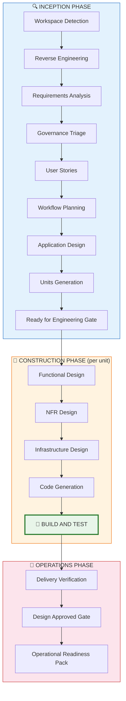
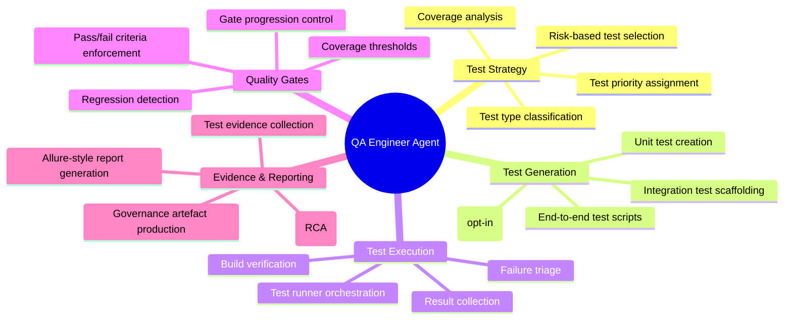
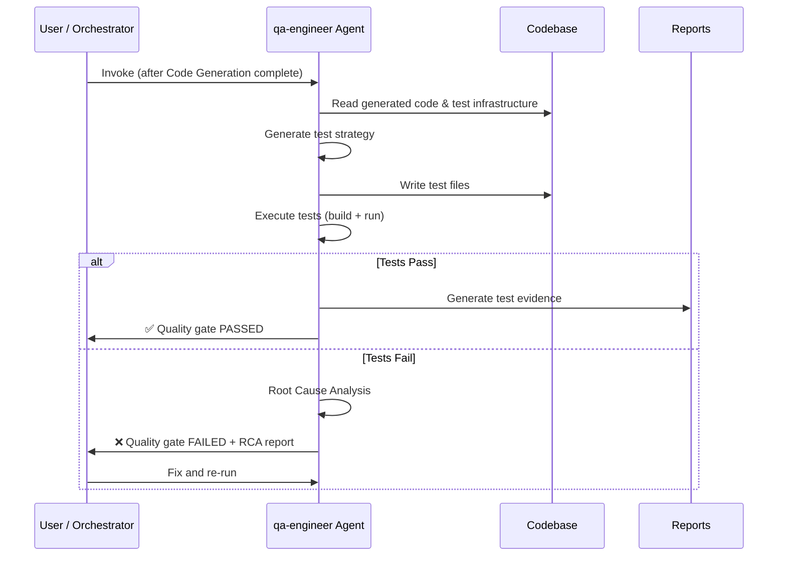
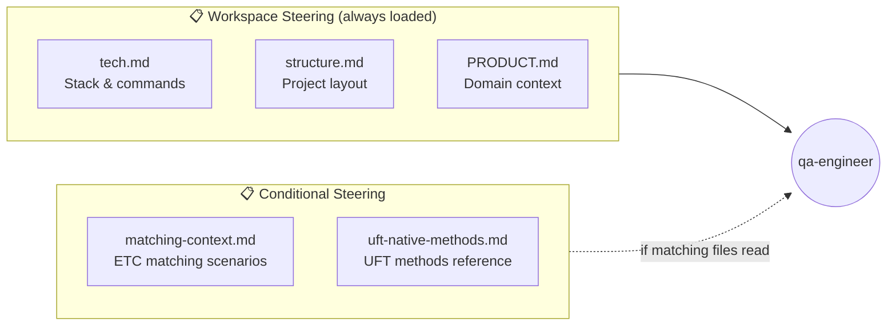
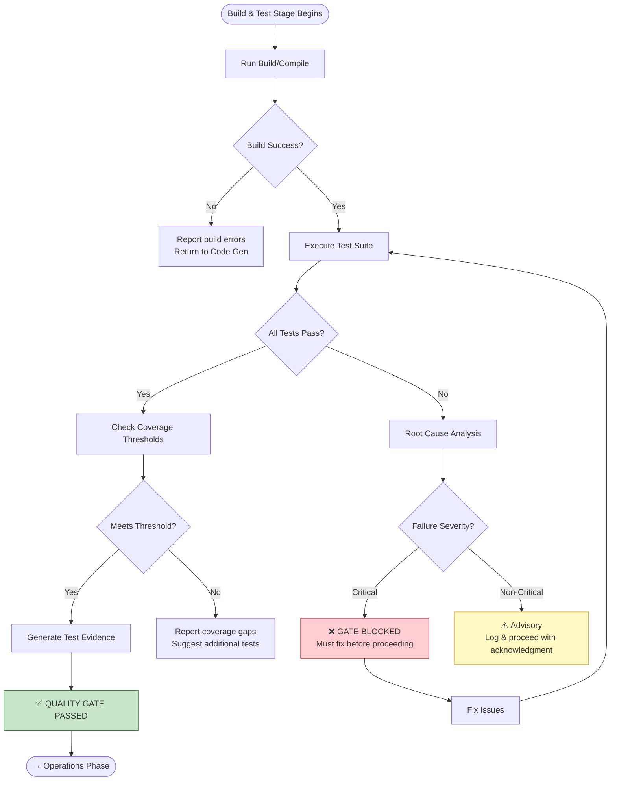
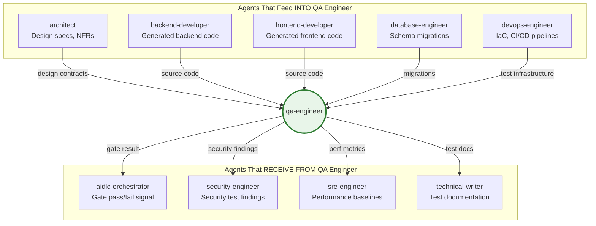
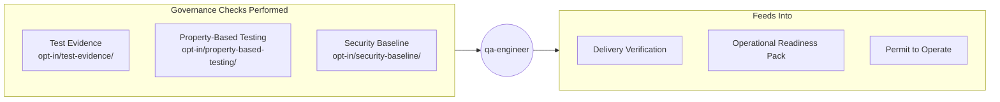

# AIDLC QA Engineer Agent — Complete Reference

> **Agent ID:** `qa-engineer`  
> **Full Name:** AI-DLC QA Engineer  
> **Platform:** Kiro (AI-powered Development Environment)  
> **Phase:** Construction → Build and Test  
> **Invocation:** `invoke_sub_agent` with `name: "qa-engineer"`

---

## Overview

The **aidlc-qa-engineer** is a built-in specialist sub-agent within Kiro's AI Development Lifecycle (AIDLC) framework. It is responsible for test strategy, test generation, test execution, quality gates, and build verification. The agent activates during the **Construction phase**, specifically at the **Build and Test** stage — the final stage before the Operations phase begins.

It does not exist as a workspace-level configuration file — it is a system-level agent embedded in Kiro's core, invoked automatically by the **aidlc-orchestrator** or manually via the `invoke_sub_agent` tool.

---

## Agent Position in the AIDLC Lifecycle



> The QA Engineer agent is activated at the **Build and Test** node (highlighted in green).

---

## Responsibilities & Capabilities



---

## Invocation Workflow



---

## Skills & Steering Files Used

The QA Engineer agent leverages the following internal references and skill files when activated:

### Core References (Always Loaded)

| Reference File | Purpose |
|---------------|---------|
| `references/construction/build-and-test.md` | Primary rules for the Build & Test stage — defines what the agent must do, quality gate criteria, and output format |
| `references/common/process-overview.md` | AIDLC workflow overview for stage awareness |
| `references/common/content-validation.md` | Ensures generated content (Mermaid, ASCII) is valid |
| `references/common/error-handling.md` | Error recovery patterns for test failures |

### Opt-In Rules (Conditional)

| Opt-In Rule | Activation Trigger | What It Does |
|------------|-------------------|--------------|
| `references/opt-in/test-evidence/` | Governance requires evidence | Collects structured test evidence + generates RCA for failures |
| `references/opt-in/property-based-testing/` | User opts in during requirements | Enables generative/property-based testing strategies |
| `references/opt-in/security-baseline/` | Security-sensitive change | Adds security-focused test assertions |

### Steering Files (Workspace-Level Context)

When operating in a specific workspace, the agent also consumes workspace steering:



---

## Quality Gate Decision Flow



---

## Integration with Other Agents



---

## Input / Output Contract

### Inputs (What the QA Agent Receives)

| Input | Source | Description |
|-------|--------|-------------|
| Generated source code | Code Generation stage | The code to be tested |
| Design specifications | Functional Design stage | What the code should do |
| NFR requirements | NFR Design stage | Performance, security, accessibility targets |
| Infrastructure config | Infrastructure Design stage | Test environment setup |
| User stories + acceptance criteria | Inception phase | Business validation criteria |
| Existing test infrastructure | Workspace | Current test framework, patterns, conventions |

### Outputs (What the QA Agent Produces)

| Output | Consumer | Description |
|--------|----------|-------------|
| Test files | Workspace | Generated test code matching project conventions |
| Test execution results | Orchestrator | Pass/fail with counts and details |
| Quality gate decision | Orchestrator | PASS / FAIL / ADVISORY |
| Test evidence artefact | ORP (Operations) | Structured evidence for governance |
| RCA report | Developer agents | Root cause analysis for failures |
| Coverage report | Orchestrator | Code and requirement coverage metrics |

---

## Governance Integration



When **test-evidence** opt-in is active, the QA Engineer produces:
- Structured JSON test results
- Traceability matrix (test ↔ requirement)
- Root Cause Analysis for any failures
- Evidence summary for the ORP

---

## Session Modes & Behaviour

| Session Objective | QA Agent Behaviour |
|-------------------|-------------------|
| **Explore** | Lighter testing — smoke tests, basic assertions, no coverage gates |
| **Deliver** | Full testing — strategy, generation, execution, gates enforced, evidence produced |

| Governance Mode | QA Agent Behaviour |
|----------------|-------------------|
| **Active** | Quality gate findings presented immediately; blocks progression if Critical |
| **Shadow** | Findings logged to `governance-shadow-log.md`; no blocking |

---

## Tools Available to the QA Agent

The qa-engineer agent has access to the full Kiro toolset:

| Tool Category | Usage |
|---------------|-------|
| **File Read/Write** | Read source code, write test files |
| **Shell Execution** | Run build commands, test runners, linters |
| **Search** | Find test patterns, existing test infrastructure |
| **Web Search** | Look up testing best practices, library docs |
| **Diagnostics** | Check for compile/lint errors in generated tests |
| **Sub-Agent Invocation** | Can delegate to general-task-execution for parallel test runs |

---

## Example Invocation

```
invoke_sub_agent(
  name: "qa-engineer",
  prompt: "Generate and execute tests for the new ETCLib_Matching module. 
           Follow the existing VBScript/UFT patterns in TestSuites/ETC/. 
           Use the Allure reporting pattern (InitReport → ReportTestStepEvent → GenerateAllureReport).
           Validate against the scenarios in ScenarioDocumentation/GTN_ETC Matching Features 2.xlsx.",
  explanation: "Delegating test generation and execution for the matching feature to the QA specialist agent.",
  contextFiles: [
    { path: "d:\\uft_automation\\Libraries\\ETC\\ETCLib_Matching.qfl" },
    { path: "d:\\uft_automation\\Libraries\\Shared\\ReportLibrary.qfl" },
    { path: "d:\\uft_automation\\ScenarioDocumentation\\GTN_ETC Matching Features  2.xlsx" }
  ]
)
```

---

## Summary

The `aidlc-qa-engineer` is a **system-level specialist agent** that:

1. **Activates** during the Construction phase's Build and Test stage
2. **Consumes** code from developer agents + design from architect
3. **Generates** test strategy, test code, and executes tests
4. **Enforces** quality gates before allowing progression to Operations
5. **Produces** test evidence for governance (ORP, PtO, CAB)
6. **Integrates** with workspace steering files for project-specific conventions
7. **Supports** both Explore (light) and Deliver (full) testing modes

It is the final checkpoint between building code and shipping it.

---

*Generated: 2026-06-03 | Agent Version: Built-in (Kiro Platform)* 