# AIDLC Requirements Analyst Agent — Complete Reference

m

> **Agent ID:** `aidlc-requirements-analyst`  

> **Installed In:** Apex (Kiro IDE Extension)  

> **Version:** Defined in `~/.kiro/agents/aidlc-requirements-analyst.json`  

> **Author:** architecture-team / aidlc-framework


---


## 1. Overview


The **aidlc-requirements-analyst** is a specialist sub-agent within the AI-Driven Development Lifecycle (AI-DLC) framework. It is responsible for gathering, analysing, validating, and structuring requirements during the **Inception Phase → Requirements Analysis** stage.


Unlike construction-phase agents (backend, frontend, devops), the requirements analyst operates at the **very beginning** of the lifecycle — it is the first substantive stage after Workspace Detection. Its output shapes every downstream decision: user stories, architecture design, code generation, and governance classification.


It is **never invoked directly by the user**. The **aidlc-orchestrator** agent delegates work to it when the workflow reaches the Requirements Analysis stage.


---


## 2. Agent Configuration


```json

{

  "name": "aidlc-requirements-analyst",

  "description": "AI-DLC requirements analyst for requirements gathering, intent analysis, clarifying questions, and NFR identification.",

  "prompt": "file://./aidlc-requirements-analyst.md",

  "tools": ["read", "write", "shell"],

  "allowedTools": ["read"],

  "resources": [

    "file://.kiro/steering/**/*.md",

    "skill://.kiro/skills/**/SKILL.md",

    "file://~/.kiro/steering/**/*.md",

    "skill://~/.kiro/skills/**/SKILL.md"

  ]

}

```


| Property | Value | Purpose |

|----------|-------|---------|

| `tools` | `read`, `write`, `shell` | Can read files, write questions/docs, run shell for discovery |

| `allowedTools` | `read` | Auto-approved without user confirmation |

| `resources` | Workspace + user steering & skills | Access to all enterprise rules and project context |


---


## 3. Role & Responsibilities


```

┌─────────────────────────────────────────────────────┐

│          AIDLC Requirements Analyst                  │

├─────────────────────────────────────────────────────┤

│ • Analyse user intent from initial request          │

│ • Generate structured clarifying questions          │

│ • Identify functional requirements (FRs)            │

│ • Identify non-functional requirements (NFRs)       │

│ • Detect ambiguities, gaps, and contradictions      │

│ • Classify requirements by priority (MoSCoW)        │

│ • Map requirements to affected system components    │

│ • Determine opt-in governance rules applicability   │

│ • Produce requirements.md artifact for downstream   │

│   consumption                                       │

│ • Validate requirements with user via Q&A rounds    │

│ • Apply overconfidence prevention (question gen)    │

│ • Respect adaptive depth levels based on change     │

│   complexity                                        │

└─────────────────────────────────────────────────────┘

```


---


## 4. Position in the AI-DLC Lifecycle


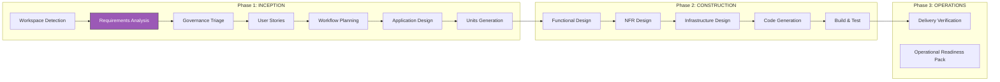


> The **Requirements Analyst** agent is activated at the **Requirements Analysis** stage (highlighted above). It is the first analytical stage — immediately after Workspace Detection establishes the session context.


---


## 5. Invocation & Delegation Flow


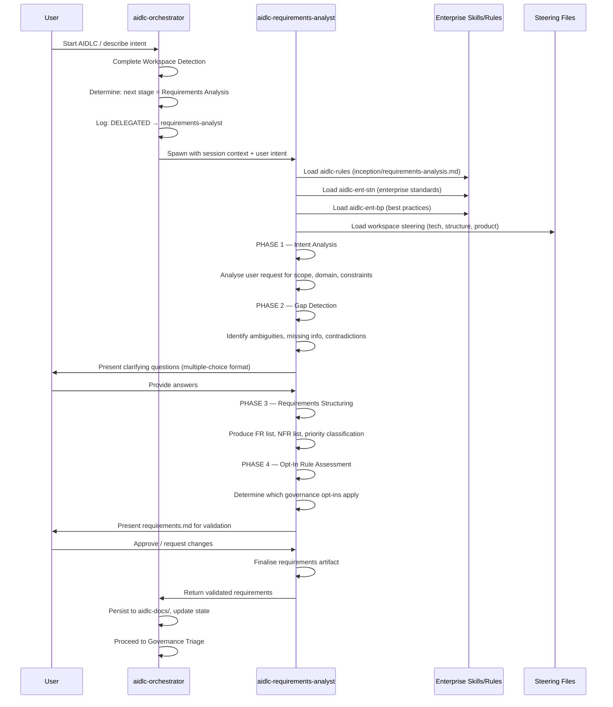


---


## 6. Multi-Phase Execution Workflow


```mermaid

flowchart TD

    subgraph PHASE1["PHASE 1: INTENT ANALYSIS"]

        I1[Read user's initial request] --> I2[Identify primary objective]

        I2 --> I3[Determine scope: greenfield vs brownfield]

        I3 --> I4[Identify affected systems/components]

        I4 --> I5[Assess change complexity level]

        I5 --> I6[Select adaptive depth level]

    end



    subgraph PHASE2["PHASE 2: GAP DETECTION & QUESTIONING"]

        Q1[Scan for ambiguities in intent] --> Q2[Identify missing information]

        Q2 --> Q3[Check for contradictions]

        Q3 --> Q4[Apply overconfidence prevention]

        Q4 --> Q5[Generate clarifying questions]

        Q5 --> Q6[Format as multiple-choice + Answer format]

        Q6 --> Q7[Present to user in .md file]

        Q7 --> Q8[Process user responses]

        Q8 --> Q9{Sufficient clarity?}

        Q9 -->|No| Q4

        Q9 -->|Yes| R1

    end



    subgraph PHASE3["PHASE 3: REQUIREMENTS STRUCTURING"]

        R1[Extract functional requirements] --> R2[Extract non-functional requirements]

        R2 --> R3[Classify by priority: MoSCoW]

        R3 --> R4[Map to system components]

        R4 --> R5[Identify dependencies & constraints]

        R5 --> R6[Document assumptions]

        R6 --> R7[Write requirements.md]

    end



    subgraph PHASE4["PHASE 4: GOVERNANCE & OPT-IN ASSESSMENT"]

        G1[Evaluate opt-in rules applicability] --> G2[Check: Jira sync needed?]

        G2 --> G3[Check: Security baseline applicable?]

        G3 --> G4[Check: Property-based testing?]

        G4 --> G5[Check: AI compliance needed?]

        G5 --> G6[Check: ADB/ADS required?]

        G6 --> G7[Record opt-in decisions]

        G7 --> G8[Present requirements for validation]

    end



    I6 --> Q1

    R7 --> G1



    style PHASE1 fill:#e8daef,stroke:#6c3483

    style PHASE2 fill:#d4efdf,stroke:#1e8449

    style PHASE3 fill:#d6eaf8,stroke:#2471a3

    style PHASE4 fill:#fdebd0,stroke:#d35400

```


---


## 7. Skills & Steering Files Used


### 7.1 Skills Loaded at Runtime


```mermaid

graph TD

    RA[aidlc-requirements-analyst] --> RULES[aidlc-rules
Stage Rules]

    RA --> ENT_STN[aidlc-ent-stn
Enterprise Standards]

    RA --> ENT_BP[aidlc-ent-bp
Enterprise Best Practices]

    RA --> GUIDE[aidlc-guide
Process Guidance]



    RULES --> REQ_ANALYSIS[inception/requirements-analysis.md
Primary stage rules]

    RULES --> COMMON1[common/question-format-guide.md
Multiple-choice + Answer format]

    RULES --> COMMON2[common/overconfidence-prevention.md
Question generation rules]

    RULES --> COMMON3[common/depth-levels.md
Adaptive depth selection]

    RULES --> COMMON4[common/content-validation.md
Mermaid/ASCII standards]

    RULES --> COMMON5[common/error-handling.md
Error recovery patterns]

    RULES --> COMMON6[common/workflow-changes.md
Mid-workflow change handling]

    RULES --> COMMON7[common/terminology.md
AIDLC glossary]

    RULES --> GOV_TRIAGE[inception/governance-triage.md
Materiality classification prep]



    RULES --> OPTIN1[opt-in/jira-sync/
Jira integration rules]

    RULES --> OPTIN2[opt-in/security-baseline/
Security baseline]

    RULES --> OPTIN3[opt-in/property-based-testing/
PBT rules]

    RULES --> OPTIN4[opt-in/ai-compliance/
AI impact assessment]

    RULES --> OPTIN5[opt-in/adb/
Architecture Design Brief]

    RULES --> OPTIN6[opt-in/ads/
Architecture Design Summary]

    RULES --> OPTIN7[opt-in/standards-check/
ADR standards checking]



    ENT_STN --> STN_IAM[ent-stn-iam.md
IAM requirements identification]

    ENT_STN --> STN_SEC[ent-stn-secrets.md
Secrets handling NFRs]

    ENT_STN --> STN_ENC[ent-stn-encryption.md
Encryption NFRs]

    ENT_STN --> STN_LOG[ent-stn-logging.md
Logging NFRs]

    ENT_STN --> STN_ENV[ent-stn-environments.md
Environment NFRs]

    ENT_STN --> STN_DEV[ent-stn-devops.md
CI/CD NFRs]



    ENT_BP --> BP_API[api-design.md
API quality requirements]

    ENT_BP --> BP_OBS[observability.md
Observability NFRs]

    ENT_BP --> BP_RES[resiliency.md
Resiliency requirements]

    ENT_BP --> BP_SEC[containers.md
Container security NFRs]



    style RA fill:#9b59b6,stroke:#333,color:#fff

    style RULES fill:#e8f5e9,stroke:#363

    style ENT_STN fill:#fde8e8,stroke:#633

    style ENT_BP fill:#dceefb,stroke:#336

    style GUIDE fill:#fff3cd,stroke:#856404

```


### 7.2 Skill Details


| Skill | Type | Purpose | Relevance to Requirements Analyst |

|-------|------|---------|-----------------------------------|

| `aidlc-rules` | Stage Rules | Requirements analysis workflow, question format, depth levels, opt-in assessment | **Primary skill** — governs entire execution flow |

| `aidlc-ent-stn` | Standards (MUST) | Mandatory enterprise requirements for IAM, secrets, encryption, logging, CI/CD | Used to identify implicit NFRs that the user may not have stated |

| `aidlc-ent-bp` | Best Practices (SHOULD) | Recommended patterns for APIs, observability, resiliency, containers | Used to suggest additional NFRs based on the system's nature |

| `aidlc-guide` | Process Guidance | Explains how the AIDLC works, what governance applies, why questions are being asked | Loaded when the user asks process questions during requirements analysis |


### 7.3 Core Stage Rules (from `aidlc-rules`)


| Rule File | What It Controls |

|-----------|-----------------|

| `inception/requirements-analysis.md` | Primary execution logic: phases, question generation, FR/NFR extraction, output format |

| `common/question-format-guide.md` | All questions must be multiple-choice with `[Answer]:` format in .md files |

| `common/overconfidence-prevention.md` | Agent must generate questions even when it thinks it knows the answer — prevents assumptions |

| `common/depth-levels.md` | Adapts analysis depth based on change complexity (trivial → critical) |

| `common/content-validation.md` | Mermaid diagrams, ASCII art standards for requirement docs |

| `common/error-handling.md` | Recovery if questioning rounds fail or produce contradictions |

| `common/workflow-changes.md` | Handles user pivots mid-requirements (scope change, new constraints) |

| `inception/governance-triage.md` | Pre-classification data needed for the next stage (governance triage) |


### 7.4 Opt-In Rules Assessment


During requirements analysis, the agent evaluates which opt-in governance rules should activate for the session:


| Opt-In Rule | Question Asked | Triggers When |

|-------------|---------------|---------------|

| `jira-sync` | Sync requirements/stories to Jira? | Always asked if Jira MCP configured |

| `security-baseline` | Apply security baseline checks? | System handles sensitive data, auth, or external APIs |

| `property-based-testing` | Use property-based testing? | Complex business logic, state machines, data transformations |

| `ai-compliance` | Require AI Impact Assessment? | AI/ML components in scope |

| `adb` | Generate Architecture Design Brief? | Material architecture change (determined by triage) |

| `ads` | Generate Architecture Design Summary? | Minor architecture change (lighter than ADB) |

| `standards-check` | Check ADRs against standards? | **Always on** — runs automatically when ADRs are written |


### 7.5 Steering Files Accessible


The agent has access to all steering files at both levels:


| Scope | Path Pattern | Content |

|-------|-------------|---------|

| Workspace | `.kiro/steering/**/*.md` | Project-specific context (tech stack, structure, product domain) |

| User/Global | `~/.kiro/steering/**/*.md` | Cross-project enterprise rules |


**Current workspace steering files available to the agent:**


| File | How the Agent Uses It |

|------|----------------------|

| `tech.md` | Identifies technical constraints (UFT, VBScript, Windows-only) for requirement feasibility |

| `structure.md` | Maps requirements to existing project modules and isolation boundaries |

| `PRODUCT.md` | Understands domain context (ETC/GTN/JETS trade flow) for domain-specific questions |

| `matching-context.md` | Market matching business rules for matching-related requirements |

| `uft-native-methods.md` | Available UFT capabilities to assess automation feasibility |


---


## 8. Requirements Output Artifact Structure


The requirements analyst produces a structured document at:

```

aidlc-docs/inception/requirements.md

```


### Document Structure


```mermaid

graph TD

    subgraph ARTIFACT["requirements.md"]

        H[Header & Metadata] --> OBJ[Objective Statement]

        OBJ --> SCOPE[Scope Definition]

        SCOPE --> FR[Functional Requirements]

        FR --> NFR[Non-Functional Requirements]

        NFR --> CONST[Constraints & Assumptions]

        CONST --> DEPS[Dependencies]

        DEPS --> RISKS[Risks & Open Questions]

        RISKS --> PRIORITY[Priority Classification]

        PRIORITY --> OPTIN[Opt-In Decisions]

        OPTIN --> TRACE[Traceability Matrix]

    end



    style ARTIFACT fill:#f4ecf7,stroke:#6c3483

```


### Section Details


| Section | Content | Format |

|---------|---------|--------|

| **Objective** | Single paragraph stating what the user wants to achieve | Prose |

| **Scope** | In-scope / out-of-scope boundary | Bullet lists |

| **Functional Requirements** | Numbered FRs with description and acceptance criteria | `FR-001: ...` format |

| **Non-Functional Requirements** | Numbered NFRs categorised by type (performance, security, etc.) | `NFR-001: ...` format |

| **Constraints** | Technical and business limitations | Bullet list |

| **Dependencies** | External systems, teams, or prerequisites | Table |

| **Risks** | Identified risks with likelihood and impact | Table |

| **Priority** | MoSCoW classification (Must/Should/Could/Won't) | Table mapping FRs/NFRs |

| **Opt-In Decisions** | Which governance rules are active for this session | Checklist |

| **Traceability** | Maps each requirement to affected components | Cross-reference table |


---


## 9. Question Generation & Adaptive Depth


### 9.1 Adaptive Depth Levels


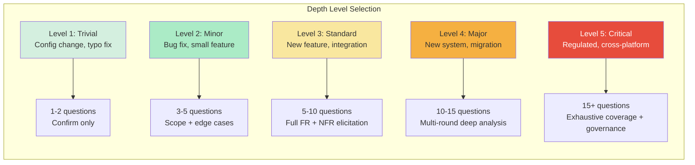


### 9.2 Question Format (Mandatory)


All questions are written to `.md` files (never in chat) using this format:


```markdown

### Q1: [Question text]


a) Option A  

b) Option B  

c) Option C  

d) Other (please specify)


[Answer]:

```


### 9.3 Overconfidence Prevention


The agent applies systematic doubt even when the user's intent seems clear:


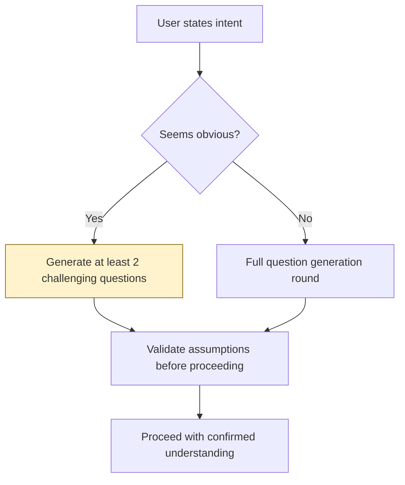


**Rules:**

- Never assume scope boundaries without confirming

- Never assume NFRs without validating (e.g., don't assume "high availability" — ask)

- Always verify edge cases the user hasn't mentioned

- Always check for unstated constraints (regulatory, performance, cost)


---


## 10. NFR Identification Pattern


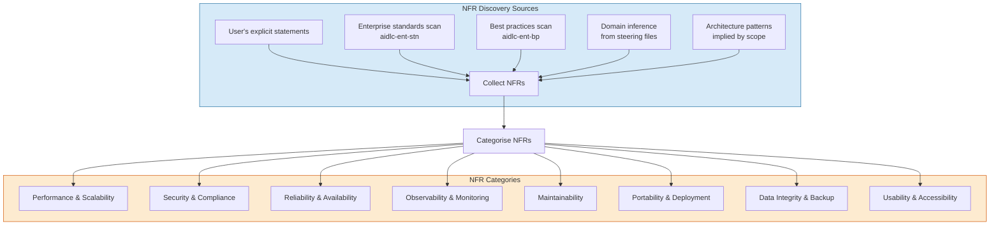


**Enterprise Standards → NFR Mapping:**


| Enterprise Standard | Generated NFR Category | Example NFR |

|--------------------|-----------------------|-------------|

| `ent-stn-iam.md` | Security | "System must authenticate via Okta OIDC with PKCE flow" |

| `ent-stn-secrets.md` | Security | "No secrets stored in source code; use approved vault" |

| `ent-stn-encryption.md` | Security | "All data in transit encrypted with TLS 1.2+" |

| `ent-stn-logging.md` | Observability | "Structured JSON logs with correlation IDs" |

| `ent-stn-environments.md` | Deployment | "Production data never in non-production environments" |

| `ent-stn-devops.md` | Deployment | "All changes via CI/CD pipeline with quality gates" |

| `arch-stn-828-data.md` | Data Integrity | "Data retention per classification tier" |


---


## 11. Critical Rules & Constraints


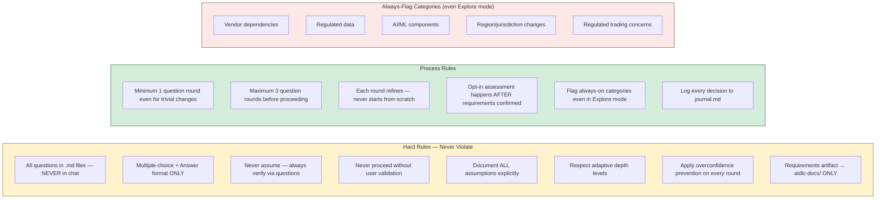


---


## 12. Interaction with Other Agents


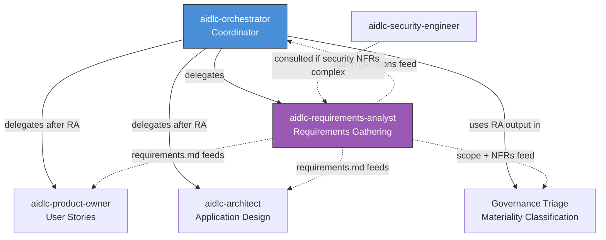


| Downstream Consumer | What It Receives from Requirements Analyst |

|--------------------|-------------------------------------------|

| `aidlc-orchestrator` | Opt-in decisions, scope classification, governance flags |

| **Governance Triage** (orchestrator stage) | Change scope, affected systems, NFR categories → for materiality classification |

| `aidlc-product-owner` | Functional requirements → converts to user stories with acceptance criteria |

| `aidlc-architect` | Full requirements (FR + NFR + constraints) → drives architecture decisions |

| `aidlc-security-engineer` | Security-related NFRs → if on-demand security review is triggered |


| Upstream Input | Source |

|---------------|--------|

| User's initial request | Chat message / prompt |

| Session context (greenfield/brownfield, Explore/Deliver) | `aidlc-orchestrator` via Workspace Detection |

| Existing artefacts (if any) | Previous `aidlc-state.md`, governance artefacts provided by user |

| Workspace steering files | `.kiro/steering/**/*.md` — loaded automatically |


---


## 13. End-to-End Flow: From User Intent to Validated Requirements


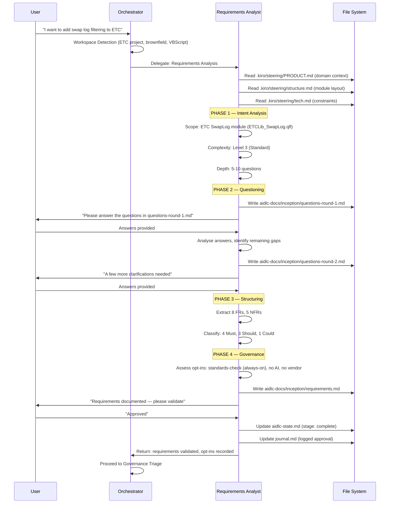


---


## 14. Handling Edge Cases


### 14.1 User Provides Existing Requirements


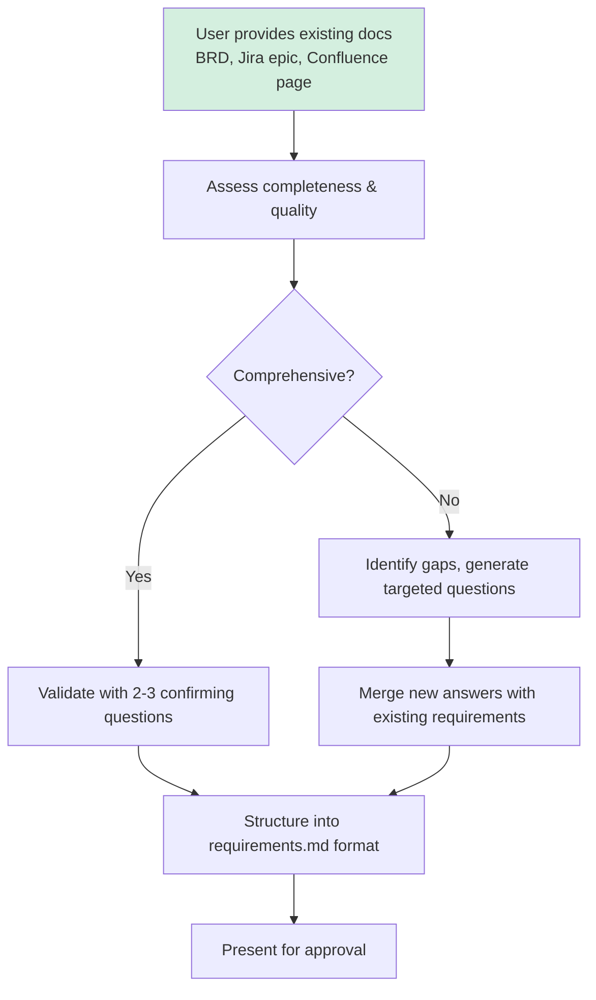


### 14.2 User Wants to Skip Requirements


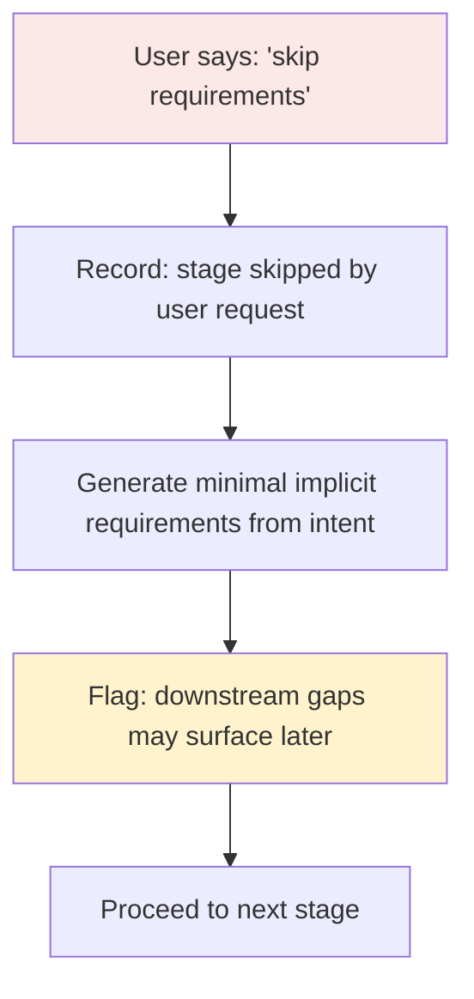


### 14.3 Mid-Requirements Scope Change


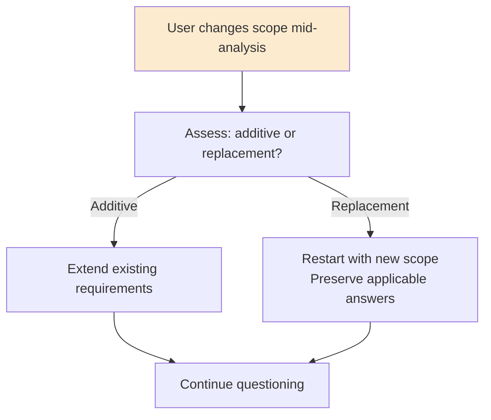


---


## 15. Governance Preparation (for next stage)


The requirements analyst collects data that feeds directly into Governance Triage:


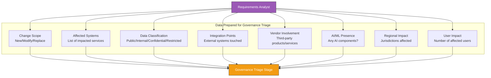


---


## 16. Completion Criteria


The requirements analyst agent marks its work as **complete** when ALL of these are true:


- [x] User's intent fully understood and documented

- [x] At least one question round completed (overconfidence prevention)

- [x] All functional requirements numbered and described with acceptance criteria

- [x] All non-functional requirements identified (explicit + implied from standards)

- [x] MoSCoW prioritisation applied to all requirements

- [x] Constraints and assumptions documented

- [x] Opt-in governance rules assessed and decisions recorded

- [x] `requirements.md` written to `aidlc-docs/inception/`

- [x] User has explicitly validated the requirements document

- [x] `aidlc-state.md` updated with completion status

- [x] `journal.md` logged with approval timestamp and key decisions


---


## 17. Summary


The `aidlc-requirements-analyst` is a systematic, assumption-challenging, governance-aware requirements elicitation agent that:


1. **Never assumes** — it applies overconfidence prevention to generate questions even when the answer seems obvious

2. **Never asks in chat** — all questions are written to `.md` files in multiple-choice format for traceability

3. **Adapts depth** — trivial changes get 1-2 questions; critical changes get exhaustive multi-round analysis

4. **Identifies implicit NFRs** — scans enterprise standards and best practices to surface requirements the user hasn't stated

5. **Prepares governance data** — collects materiality inputs so the next stage (Governance Triage) can classify the change

6. **Assesses opt-in rules** — determines which governance rules activate for the session based on the change's nature

7. **Produces a structured artifact** — `requirements.md` with FRs, NFRs, priorities, constraints, assumptions, and traceability

8. **Respects session objective** — adjusts rigour based on Explore vs Deliver mode while always flagging the five mandatory categories

9. **Handles pivots gracefully** — mid-analysis scope changes are absorbed, not rejected

10. **Maintains traceability** — every requirement traces back to a user answer, and forward to user stories and architecture decisions


---


*Generated: June 4, 2026 | Source: `~/.kiro/agents/aidlc-requirements-analyst.json` + `aidlc-requirements-analyst.md` + `aidlc-rules` skill*

 